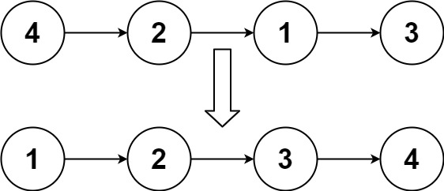
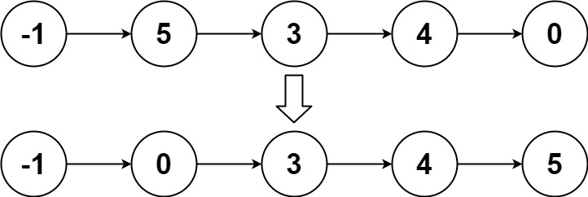

# 148. Sort List


## Level - medium


## Task
Given the head of a linked list, return the list after sorting it in ascending order.


## Объяснение
Задача предлагает вам отсортировать связный список, который не гарантированно отсортирован.

Для решения этой задачи мы можем использовать алгоритм сортировки слиянием, 
который имеет временную сложность O(n log n) и пространственную сложность O(log n), 
где n - количество элементов в списке.


## Example 1:

````
Input: head = [4,2,1,3]
Output: [1,2,3,4]
````


## Example 2:

````
Input: head = [-1,5,3,4,0]
Output: [-1,0,3,4,5]
````


## Example 3:
````
Input: head = []
Output: []
````


## Constraints:
- The number of nodes in the list is in the range [0, 5 * 10^4].
- -10^5 <= Node.val <= 10^5

Follow up: Can you sort the linked list in O(n logn) time and O(1) memory (i.e. constant space)?