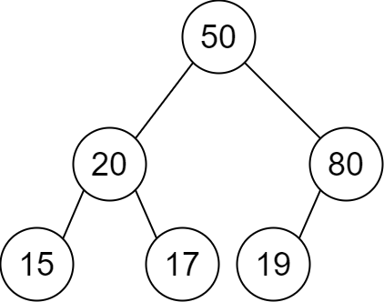
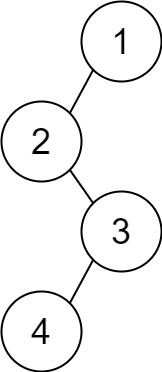

# 2196. Create Binary Tree From Descriptions


## Level - Medium


## Task
You are given a 2D integer array descriptions where descriptions[i] = [parent_i, child_i, isLeft_i] 
indicates that parent_i is the parent of child_i in a binary tree of unique values. Furthermore,
- If isLeft_i == 1, then child_i is the left child of parent_i.
- If isLeft_i == 0, then child_i is the right child of parent_i.

Construct the binary tree described by descriptions and return its root.

The test cases will be generated such that the binary tree is valid.


## Объяснение
Задача требует от нас создать бинарное дерево на основе набора описаний. 
Каждое описание состоит из трех элементов: родительский узел, дочерний узел и флаг, указывающий, 
является ли дочерний узел левым или правым потомком родительского узла.

Для решения этой задачи можно использовать словарь для хранения узлов и их связей, 
а затем найти корневой узел, который не является дочерним ни для одного из узлов.


## Example 1:

````
Input: descriptions = [[20,15,1],[20,17,0],[50,20,1],[50,80,0],[80,19,1]]
Output: [50,20,80,15,17,19]
Explanation: The root node is the node with value 50 since it has no parent.
The resulting binary tree is shown in the diagram.
````


## Example 2:

````
Input: descriptions = [[1,2,1],[2,3,0],[3,4,1]]
Output: [1,2,null,null,3,4]
Explanation: The root node is the node with value 1 since it has no parent.
The resulting binary tree is shown in the diagram.
````


## Constraints:

- 1 <= descriptions.length <= 10^4
- descriptions[i].length == 3
- 1 <= parenti, childi <= 10^5
- 0 <= isLeft_i <= 1
- The binary tree described by descriptions is valid.