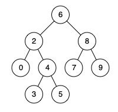

# 235. Lowest Common Ancestor of a Binary Search Tree


## Level - medium


## Task
Given a binary search tree (BST), find the lowest common ancestor (LCA) node of two given nodes in the BST.

According to the definition of LCA on Wikipedia: 
“The lowest common ancestor is defined between two nodes p and q as the lowest node in T that has both p 
and q as descendants (where we allow a node to be a descendant of itself).”


## Объяснение
Задача (Наименьший общий предок в бинарном дереве поиска) заключается в нахождении наименьшего общего предка (LCA) двух узлов в бинарном дереве поиска (BST). 
Наименьший общий предок двух узлов p и q — это самый нижний узел, который имеет p и q как своих потомков (не обязательно прямых).

В бинарном дереве поиска (BST) каждый узел имеет не более двух потомков, и все значения в левом поддереве меньше значения узла, 
а все значения в правом поддереве больше значения узла. Это свойство позволяет эффективно находить LCA.

Алгоритм нахождения LCA в BST может быть следующим:
1. Начиная с корня дерева, сравниваем значения p и q с текущим узлом.
2. Если оба значения p и q меньше текущего узла, то LCA находится в левом поддереве.
3. Если оба значения p и q больше текущего узла, то LCA находится в правом поддереве.
4. Если одно значение меньше, а другое больше текущего узла, то текущий узел и есть LCA.

Этот алгоритм работает за линейное время O(h), где h — высота дерева.

Пример:
````
        6
       / \
      2   8
     / \ / \
    0  4 7  9
      / \
     3  5
````
Если p = 2 и q = 8, то LCA будет узел с значением 6.
Если p = 2 и q = 4, то LCA будет узел с значением 2.

Таким образом, задача заключается в написании функции, которая принимает корень BST и два узла p и q, 
и возвращает их наименьшего общего предка.


## Example 1:

````
Input: root = [6,2,8,0,4,7,9,null,null,3,5], p = 2, q = 8
Output: 6
Explanation: The LCA of nodes 2 and 8 is 6.
````


## Example 2:

````
Input: root = [6,2,8,0,4,7,9,null,null,3,5], p = 2, q = 4
Output: 2
Explanation: The LCA of nodes 2 and 4 is 2, since a node can be a descendant of itself according to the LCA definition.
````


## Example 3:
````
Input: root = [2,1], p = 2, q = 1
Output: 2
````


## Constraints:
- The number of nodes in the tree is in the range [2, 1^05].
- -10^9 <= Node.val <= 10^9
- All Node.val are unique.
- p != q
- p and q will exist in the BST.