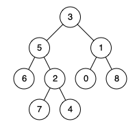

# 236. Lowest Common Ancestor of a Binary Tree


## Level - medium


## Task
Given a binary tree, find the lowest common ancestor (LCA) of two given nodes in the tree.

According to the definition of LCA on Wikipedia: 
“The lowest common ancestor is defined between two nodes p and q as the lowest node in T that has both p and q as descendants 
(where we allow a node to be a descendant of itself).”


## Объяснение
Задача требует от нас найти наименьшего общего предка (LCA) двух узлов в бинарном дереве. 
Наименьший общий предок двух узлов p и q — это самый нижний узел, который имеет в качестве своих потомков как p, так и q.

Пример:
````
      3
     / \
    5   1
   / \ / \
  6  2 0  8
    / \
   7   4
````
- Если p = 5 и q = 1, то LCA — это узел 3.
- Если p = 5 и q = 4, то LCA — это узел 5.


## Example 1:

````
Input: root = [3,5,1,6,2,0,8,null,null,7,4], p = 5, q = 1
Output: 3
Explanation: The LCA of nodes 5 and 1 is 3.
````


## Example 2:

````
Input: root = [3,5,1,6,2,0,8,null,null,7,4], p = 5, q = 4
Output: 5
Explanation: The LCA of nodes 5 and 4 is 5, since a node can be a descendant of itself according to the LCA definition.
````


## Example 3:
````
Input: root = [1,2], p = 1, q = 2
Output: 1
````


## Constraints:
- The number of nodes in the tree is in the range [2, 10^5].
- -10^9 <= Node.val <= 10^9
- All Node.val are unique.
- p != q
- p and q will exist in the tree.