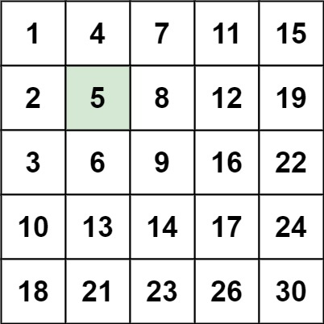
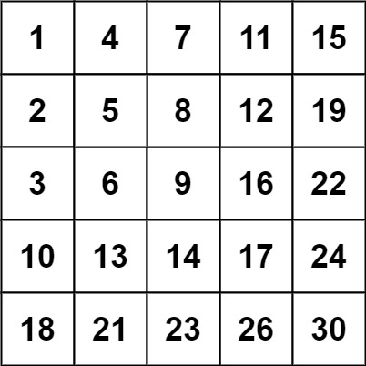

# 240. Search a 2D Matrix II


## Level - medium


## Task
Write an efficient algorithm that searches for a value target in an m x n integer matrix matrix. This matrix has the following properties:
- Integers in each row are sorted in ascending from left to right.
- Integers in each column are sorted in ascending from top to bottom.


## Объяснение
Задача требует от нас разработать эффективный алгоритм для поиска целевого значения в двумерной матрице. 
Матрица обладает следующими свойствами:
1. Каждая строка матрицы отсортирована в порядке возрастания.
2. Каждый столбец матрицы также отсортирован в порядке возрастания.

Например:
[
[1,   4,  7, 11, 15],
[2,   5,  8, 12, 19],
[3,   6,  9, 16, 22],
[10, 13, 14, 17, 24],
[18, 21, 23, 26, 30]
]

Наша задача — определить, содержится ли заданное целевое значение в этой матрице.

Один из эффективных способов решения этой задачи — использовать стратегию, 
которая начинает поиск с правого верхнего угла матрицы (или левого нижнего угла) и постепенно сужает область поиска. 
Этот подход позволяет нам использовать свойства отсортированности строк и столбцов для оптимизации поиска.

## Example 1:

````
Input: matrix = [[1,4,7,11,15],[2,5,8,12,19],[3,6,9,16,22],[10,13,14,17,24],[18,21,23,26,30]], target = 5
Output: true
````


## Example 2:

````
Input: matrix = [[1,4,7,11,15],[2,5,8,12,19],[3,6,9,16,22],[10,13,14,17,24],[18,21,23,26,30]], target = 20
Output: false
````


## Constraints:
- m == matrix.length
- n == matrix[i].length
- 1 <= n, m <= 300
- -10^9 <= matrix[i][j] <= 10^9
- All the integers in each row are sorted in ascending order.
- All the integers in each column are sorted in ascending order.
- -10^9 <= target <= 10^9