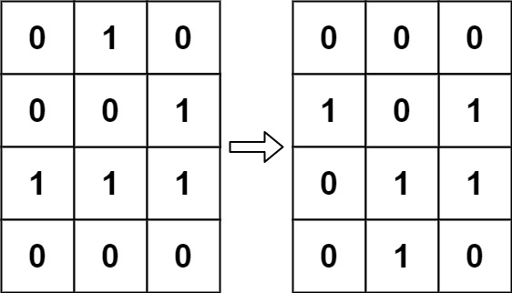
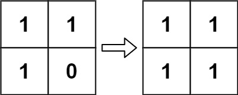

# 289. Game of Life


## Level - medium


## Task
According to Wikipedia's article: "The Game of Life, also known simply as Life, 
is a cellular automaton devised by the British mathematician John Horton Conway in 1970."

The board is made up of an m x n grid of cells, where each cell has an initial state: live (represented by a 1) or dead (represented by a 0). 
Each cell interacts with its eight neighbors (horizontal, vertical, diagonal) using the following four rules (taken from the above Wikipedia article):
1. Any live cell with fewer than two live neighbors dies as if caused by under-population. 
2. Any live cell with two or three live neighbors lives on to the next generation. 
3. Any live cell with more than three live neighbors dies, as if by over-population. 
4. Any dead cell with exactly three live neighbors becomes a live cell, as if by reproduction.
   
The next state is created by applying the above rules simultaneously to every cell in the current state, 
where births and deaths occur simultaneously. Given the current state of the m x n grid board, return the next state.


## Объяснение
В контексте задачи, как и в других задачах, связанных с "Игрой жизни", обычно требуется реализовать алгоритм, 
который моделирует эволюцию клеточного автомата в соответствии с вышеуказанными правилами.
Задача относится к классической задаче из области компьютерных наук и математики, 
известной как "Игра жизни" (Conway's Game of Life). Это клеточный автомат, изобретенный английским математиком Джоном Конвеем в 1970 году. 
Игра не является традиционной игрой с участниками, а скорее представляет собой моделирование на двумерной сетке, 
где каждая клетка может находиться в одном из двух состояний: "живая" или "мертвая". 
Правила эволюции клеток во времени следующие:
1. Живая клетка с менее чем двумя живыми соседями умирает (от одиночества).
2. Живая клетка с двумя или тремя живыми соседями продолжает жить.
3. Живая клетка с более чем тремя живыми соседями умирает (от перенаселения).
4. Мертвая клетка с ровно тремя живыми соседями становится живой (воспроизведение).


## Example 1:

````
Input: board = [[0,1,0],[0,0,1],[1,1,1],[0,0,0]]
Output: [[0,0,0],[1,0,1],[0,1,1],[0,1,0]]
````

## Example 2:

````
Input: board = [[1,1],[1,0]]
Output: [[1,1],[1,1]]
````


## Constraints:
- m == board.length 
- n == board[i].length 
- 1 <= m, n <= 25 
- board[i][j] is 0 or 1.


## Follow up:
- Could you solve it in-place? Remember that the board needs to be updated simultaneously: You cannot update some cells first and then use their updated values to update other cells.
- In this question, we represent the board using a 2D array. In principle, the board is infinite, which would cause problems when the active area encroaches upon the border of the array (i.e., live cells reach the border). How would you address these problems?