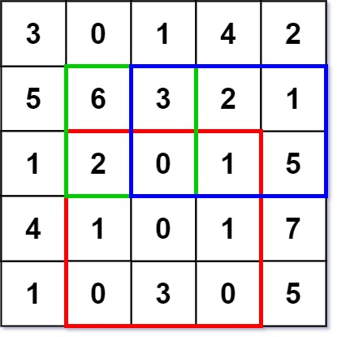

# 304. Range Sum Query 2D - Immutable

## Info

Задача 304. Range Sum Query 2D - Immutable - классическая задача на двумерные
префиксные суммы. Дана неизменяемая матрица и множество запросов на сумму элементов
внутри прямоугольника. Решается однократным построением таблицы двумерных
префиксных сумм, после чего каждый запрос обрабатывается за O(1).
Итоговая сложность: O(m*n) по времени на построение, O(m*n) по памяти и
O(1) на каждый запрос.

## Level - medium

## Task

Given a 2D array matrix, answer multiple 2D sum queries.

Implement the NumMatrix class:

- `NumMatrix(int[][] matrix)` Initializes the object with the integer matrix matrix.
- `int sumRegion(int row1, int col1, int row2, int col2)` Returns the sum of the
  elements of matrix inside the rectangle defined by its upper left corner
  (row1, col1) and lower right corner (row2, col2).

You must design an algorithm where sumRegion works on O(1) time complexity.

## Объяснение

Матрица не изменяется, а запросов на сумму может быть много (до 10^4), поэтому
вычислять сумму прямоугольника заново для каждого запроса невыгодно. Идея
простая: один раз заранее посчитать суммы всех префиксов матрицы, а затем отвечать
на каждый запрос за O(1) несколькими обращениями к готовой таблице.

Подходы:

- Bruteforce (перебор элементов прямоугольника). Для каждого запроса пройти
  по строкам от row1 до row2 и по столбцам от col1 до col2, складывая элементы.
  Реализуется тривиально, но один запрос занимает
  `O((row2 - row1 + 1) * (col2 - col1 + 1))`, то есть в худшем случае O(m*n),
  а запросов много.
- Row prefix sums (префиксные суммы по строкам). Для каждой строки заранее
  посчитать суммы всех её префиксов, тогда сумма отрезка строки берётся за O(1),
  а сумма прямоугольника складывается из этих отрезков построчно.
  Построение O(m*n), запрос O(m), так как нужно пройти по строкам прямоугольника.
- 2D prefix sums (двумерные префиксные суммы). Построить таблицу `pref` размера
  (m + 1) x (n + 1), где `pref[i][j]` - сумма всех элементов матрицы в
  подматрице `[0..i-1] x [0..j-1]`. Сумма прямоугольника получается по формуле
  включений-исключений из четырёх элементов таблицы. Построение O(m*n),
  запрос O(1).

Таблица префиксных сумм строится по формуле:

```text
pref[i+1][j+1] = matrix[i][j] + pref[i][j+1] + pref[i+1][j] - pref[i][j]
```

То есть к текущему элементу прибавляются суммы всех элементов матрицы выше и левее,
а их общая часть (подматрица `[0..i-1] x [0..j-1]`) вычитается, чтобы не учесть
её дважды.

Лишняя нулевая строка и нулевой столбец в начале таблицы избавляют от отдельных
проверок границ: `pref[0][j] = pref[i][0] = 0`, поэтому запрос, начинающийся в первой
строке или первом столбце, обрабатывается той же формулой.

Ответ на запрос:

```text
sum = pref[row2+1][col2+1] - pref[row1][col2+1] - pref[row2+1][col1] + pref[row1][col1]
```

Почему формула верна: `pref[row2+1][col2+1]` содержит всё, что нужно, и лишнее -
всё, что находится выше строки row1, левее столбца col1, и их пересечение.
Вычитаем верхнюю и левую части, а пересечение, вычтое дважды, прибавляем обратно.
В результате остаётся ровно сумма запрошенного прямоугольника.

Поскольку матрица неизменяема (в этом и состоит суть задачи Immutable), таблица
префиксов строится один раз в конструкторе, а все последующие запросы только читают
её и ничего не пересчитывают.

## Example 1



```text
Input: operations = ["NumMatrix", "sumRegion", "sumRegion", "sumRegion"]
        inputs = [[[[3, 0, 1, 4, 2], [5, 6, 3, 2, 1], [1, 2, 0, 1, 5],
                    [4, 1, 0, 1, 7], [1, 0, 3, 0, 5]]],
                  [2, 1, 4, 3], [1, 1, 2, 2], [1, 2, 2, 4]]
Output: [null, 8, 11, 12]
Explanation: sumRegion(2, 1, 4, 3) = 8, сумма красного прямоугольника,
             sumRegion(1, 1, 2, 2) = 11, сумма зелёного прямоугольника,
             sumRegion(1, 2, 2, 4) = 12, сумма синего прямоугольника.
```

## Example 2

```text
Input: operations = ["NumMatrix", "sumRegion", "sumRegion"]
        inputs = [[[[1, 2, 3], [4, 5, 6], [7, 8, 9]]],
                  [0, 0, 1, 1], [1, 1, 2, 2]]
Output: [null, 12, 28]
Explanation: sumRegion(0, 0, 1, 1) = 12 (1 + 2 + 4 + 5),
             sumRegion(1, 1, 2, 2) = 28 (5 + 6 + 8 + 9).
```

## Constraints

- m == matrix.length
- n == matrix[i].length
- 1 <= m, n <= 200
- -10^4 <= `matrix[i][j]` <= 10^4
- 0 <= row1 <= row2 < m
- 0 <= col1 <= col2 < n
- At most 10^4 calls will be made to sumRegion

## См. также

- [Bruteforce (перебор элементов прямоугольника)](ver1_bruteforce/main.go)
- [Row prefix sums (префиксные суммы по строкам)](ver2_row_prefix_sum/main.go)
- [2D prefix sums (двумерные префиксные суммы)](ver3_2d_prefix_sum/main.go)
- [Prefix sum](../../../approach/prefix_sum/README.md)
