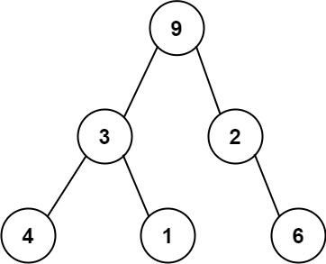

# 331. Verify Preorder Serialization of a Binary Tree


## Level - medium 


## Task
One way to serialize a binary tree is to use preorder traversal. When we encounter a non-null node, we record the node's value. 
If it is a null node, we record using a sentinel value such as '#'.


For example, the above binary tree can be serialized to the string "9,3,4,#,#,1,#,#,2,#,6,#,#", where '#' represents a null node.

Given a string of comma-separated values preorder, return true if it is a correct preorder traversal serialization of a binary tree.

It is guaranteed that each comma-separated value in the string must be either an integer or a character '#' representing null pointer.


You may assume that the input format is always valid.
- For example, it could never contain two consecutive commas, such as "1,,3".

Note: You are not allowed to reconstruct the tree.


## Объяснение
Задача заключается в проверке, является ли данная строка, 
представляющая собой сериализацию бинарного дерева в порядке preorder (префиксном порядке), корректной.

В порядке preorder обход бинарного дерева происходит следующим образом:
1. Посещается корень.
2. Обходится левое поддерево.
3. Обходится правое поддерево.

Строка, представляющая сериализацию, состоит из чисел и символов "#", где "#" обозначает пустое место (null узел).

Пример корректной сериализации: "9,3,4,#,#,1,#,#,2,#,6,#,#"

Задача требует написать функцию, которая принимает такую строку и возвращает true, 
если она представляет корректное бинарное дерево в порядке preorder, и false в противном случае.

Основные шаги для решения этой задачи могут включать:
1. Разбиение строки на отдельные элементы (узлы).
2. Использование стека для отслеживания текущих узлов и проверки их дочерних элементов.
3. Проверка условия, что каждый не-null узел должен иметь два дочерних элемента (которые могут быть null).
4. Обработка случаев, когда строка заканчивается некорректно или когда количество узлов не соответствует ожидаемому.


## Example 1:
````
Input: preorder = "9,3,4,#,#,1,#,#,2,#,6,#,#"
Output: true
````


## Example 2:
````
Input: preorder = "1,#"
Output: false
````


## Example 3:
````
Input: preorder = "9,#,#,1"
Output: false
````

## Constraints:
- 1 <= preorder.length <= 10^4
- preorder consist of integers in the range [0, 100] and '#' separated by commas ','.