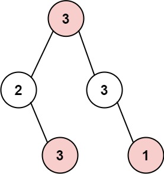

# 337. House Robber III


## Level - medium


## Task
The thief has found himself a new place for his thievery again. There is only one entrance to this area, called root.

Besides the root, each house has one and only one parent house. 
After a tour, the smart thief realized that all houses in this place form a binary tree. 
It will automatically contact the police if two directly-linked houses were broken into on the same night.

Given the root of the binary tree, return the maximum amount of money the thief can rob without alerting the police.


## Объяснение
Это задача на динамическое программирование, которая заключается в том, чтобы определить максимальную сумму, 
которую можно украсть из дома, если в каждом доме есть система безопасности, которая автоматически сигнализирует оборону, 
если в соседних домах происходит кража.

Каждый дом в этой сети описывается узлом в бинарном дереве. 
Каждый узел имеет не более двух дочерних узлов, представляющих левый и правый дочерние дома. 
Кроме того, у каждого узла есть системы безопасности, которые можно активировать. 
Однако, если вы активируете систему безопасности в любом доме, система автоматически активируется в обоих дочерних домах.

Задача состоит в том, чтобы определить максимальную сумму, которую можно украсть, не задев системы безопасности.

Пример:
````
Input: [3,2,3,null,3,null,1]
     3
    / \
   2   3
    \   \ 
     3   1

Output: 7 
Explanation: Maximum amount of money the thief can rob = 3 + 3 + 1 = 7.
````


## Example 1:

````
Input: root = [3,2,3,null,3,null,1]
Output: 7
Explanation: Maximum amount of money the thief can rob = 3 + 3 + 1 = 7.
````


## Example 2:

````
Input: root = [3,4,5,1,3,null,1]
Output: 9
Explanation: Maximum amount of money the thief can rob = 4 + 5 = 9.
````


## Constraints:
- The number of nodes in the tree is in the range [1, 10^4].
- 0 <= Node.val <= 10^4