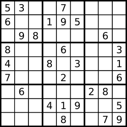

# 36. Valid Sudoku


## Level - medium


## Task
Determine if a 9 x 9 Sudoku board is valid. Only the filled cells need to be validated according to the following rules:
1. Each row must contain the digits 1-9 without repetition.
2. Each column must contain the digits 1-9 without repetition.
3. Each of the nine 3 x 3 sub-boxes of the grid must contain the digits 1-9 without repetition.

Note:
- A Sudoku board (partially filled) could be valid but is not necessarily solvable.
- Only the filled cells need to be validated according to the mentioned rules.


## Объяснение
Это задача на проверку правильности заполнения судоку. 
Судоку - это игра, в которой вам нужно заполнить сетку 9x9 цифрами от 1 до 9 таким образом, 
чтобы каждая строка, каждый столбец и каждая из девяти 3x3 квадратов содержали все цифры от 1 до 9.

Задача состоит в том, чтобы проверить, является ли заданная конфигурация судоку правильной. 
Это означает, что каждая строка, каждый столбец и каждый 3x3 квадрат должны содержать все числа от 1 до 9 без повторений.

Ваша задача - написать функцию, которая будет принимать двумерный массив, представляющий судоку, и возвращать true, 
если судоку правильно заполнено, и false, если нет.

## Example 1:

````
Input: board = 
[["5","3",".",".","7",".",".",".","."]
,["6",".",".","1","9","5",".",".","."]
,[".","9","8",".",".",".",".","6","."]
,["8",".",".",".","6",".",".",".","3"]
,["4",".",".","8",".","3",".",".","1"]
,["7",".",".",".","2",".",".",".","6"]
,[".","6",".",".",".",".","2","8","."]
,[".",".",".","4","1","9",".",".","5"]
,[".",".",".",".","8",".",".","7","9"]]
Output: true
````


## Example 2:
````
Input: board =
[["8","3",".",".","7",".",".",".","."]
,["6",".",".","1","9","5",".",".","."]
,[".","9","8",".",".",".",".","6","."]
,["8",".",".",".","6",".",".",".","3"]
,["4",".",".","8",".","3",".",".","1"]
,["7",".",".",".","2",".",".",".","6"]
,[".","6",".",".",".",".","2","8","."]
,[".",".",".","4","1","9",".",".","5"]
,[".",".",".",".","8",".",".","7","9"]]
Output: false
Explanation: Same as Example 1, except with the 5 in the top left corner being modified to 8. 
Since there are two 8's in the top left 3x3 sub-box, it is invalid.
````


## Constraints:
- board.length == 9
- board[i].length == 9
- board[i][j] is a digit 1-9 or '.'.