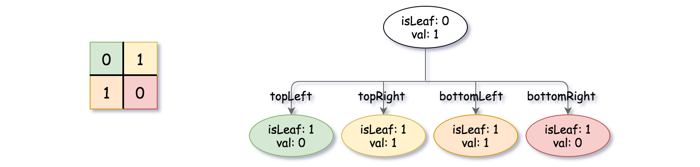
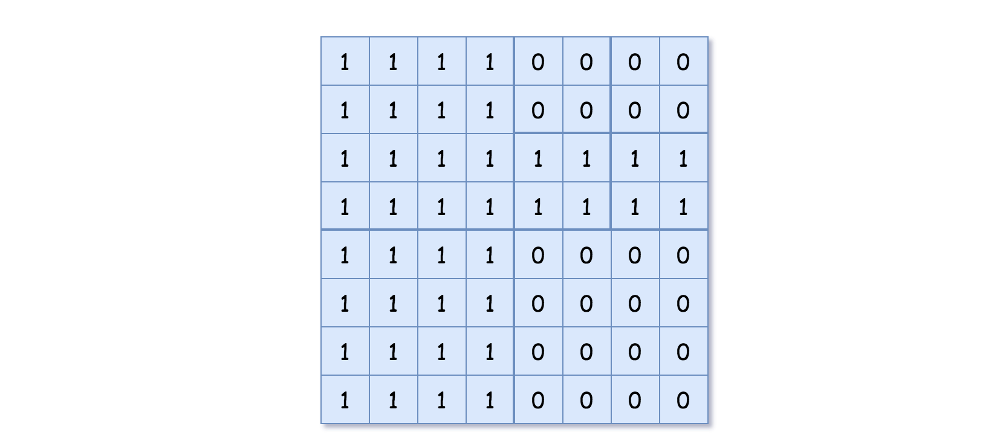
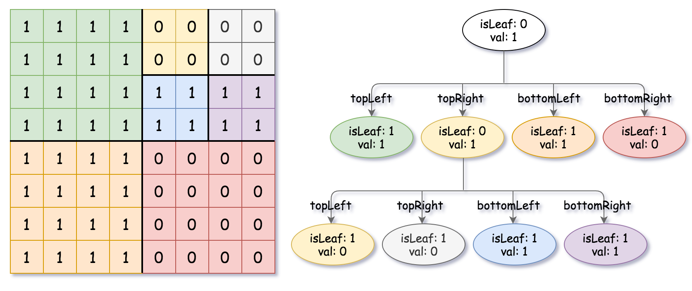

# 427. Construct Quad Tree


## Level - medium


## Task
Given a n * n matrix grid of 0's and 1's only. We want to represent grid with a Quad-Tree.

Return the root of the Quad-Tree representing grid.

A Quad-Tree is a tree data structure in which each internal node has exactly four children. 
Besides, each node has two attributes:
- val: True if the node represents a grid of 1's or False if the node represents a grid of 0's. Notice that you can assign the val to True or False when isLeaf is False, and both are accepted in the answer.
- isLeaf: True if the node is a leaf node on the tree or False if the node has four children.
````
class Node {
    public boolean val;
    public boolean isLeaf;
    public Node topLeft;
    public Node topRight;
    public Node bottomLeft;
    public Node bottomRight;
}
````

We can construct a Quad-Tree from a two-dimensional area using the following steps:
1. If the current grid has the same value (i.e all 1's or all 0's) set isLeaf True and set val to the value of the grid and set the four children to Null and stop.
2. If the current grid has different values, set isLeaf to False and set val to any value and divide the current grid into four sub-grids as shown in the photo.
3. Recurse for each of the children with the proper sub-grid.


If you want to know more about the Quad-Tree, you can refer to the wiki.

Quad-Tree format:

You don't need to read this section for solving the problem. 
This is only if you want to understand the output format here. 
The output represents the serialized format of a Quad-Tree using level order traversal, 
where null signifies a path terminator where no node exists below.

If the value of isLeaf or val is True we represent it as 1 in the list [isLeaf, val] 
and if the value of isLeaf or val is False we represent it as 0.


## Объяснение
Задача связана с созданием структуры данных, известной как Quad Tree (четверичное дерево), из заданной двумерной матрицы.

Описание задачи:
Вам дана двумерная матрица grid, состоящая из значений 0 и 1. Ваша задача — построить Quad Tree, который представляет эту матрицу.

Quad Tree — это структура данных, где каждая внутренняя вершина имеет ровно четыре дочерних узла. 
Узлы могут быть двух типов:
1. Листовой узел: Узел, который содержит все одинаковые значения (либо все 0, либо все 1).
2. Внутренний узел: Узел, который содержит четыре дочерних узла, каждый из которых представляет одну из четвертей текущего узла.

## Example 1:

````
Input: grid = [[0,1],[1,0]]
Output: [[0,1],[1,0],[1,1],[1,1],[1,0]]
Explanation: The explanation of this example is shown below:
Notice that 0 represents False and 1 represents True in the photo representing the Quad-Tree.
````



## Example 2:

````
Input: grid = [[1,1,1,1,0,0,0,0],[1,1,1,1,0,0,0,0],[1,1,1,1,1,1,1,1],[1,1,1,1,1,1,1,1],[1,1,1,1,0,0,0,0],[1,1,1,1,0,0,0,0],[1,1,1,1,0,0,0,0],[1,1,1,1,0,0,0,0]]
Output: [[0,1],[1,1],[0,1],[1,1],[1,0],null,null,null,null,[1,0],[1,0],[1,1],[1,1]]
Explanation: All values in the grid are not the same. We divide the grid into four sub-grids.
The topLeft, bottomLeft and bottomRight each has the same value.
The topRight have different values so we divide it into 4 sub-grids where each has the same value.
Explanation is shown in the photo below:
````



## Constraints:
- n == grid.length == grid[i].length
- n == 2x where 0 <= x <= 6