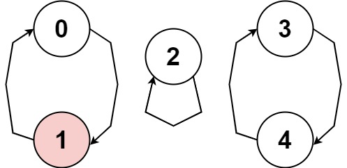

# 457. Circular Array Loop


## Level - Medium


## Task
You are playing a game involving a circular array of non-zero integers nums. Each nums[i] denotes the number of indices forward/backward you must move if you are located at index i:
- If nums[i] is positive, move nums[i] steps forward, and
- If nums[i] is negative, move nums[i] steps backward.


Since the array is circular, you may assume that moving forward from the last element puts you on the first element, and moving backwards from the first element puts you on the last element.

A cycle in the array consists of a sequence of indices seq of length k where:
- Following the movement rules above results in the repeating index sequence seq[0] -> seq[1] -> ... -> seq[k - 1] -> seq[0] -> ...
- Every nums[seq[j]] is either all positive or all negative.
- k > 1

Return true if there is a cycle in nums, or false otherwise.


## Объяснение
Дан массив целых чисел nums, где каждый элемент указывает, на сколько позиций нужно переместиться в массиве (положительное значение — вперед, отрицательное — назад). 
Перемещения происходят циклически, то есть если индекс выходит за границы массива, он оборачивается (например, из конца массива можно перейти в начало и наоборот).

Цель: определить, существует ли в массиве цикл, состоящий из более чем одного элемента, где все элементы цикла имеют одинаковый знак (все положительные или все отрицательные), 
и перемещения по этим элементам образуют замкнутую последовательность (возвращаются в начальную точку).

Пример:
- Вход: nums = [2,-1,1,2,2]
- Выход: true
- Объяснение: Существует цикл 0 -> 2 -> 3 -> 0, где все элементы положительные, и путь замыкается.


## Example 1:

```
Input: nums = [2,-1,1,2,2]
Output: true
Explanation: The graph shows how the indices are connected. White nodes are jumping forward, while red is jumping backward.
We can see the cycle 0 --> 2 --> 3 --> 0 --> ..., and all of its nodes are white (jumping in the same direction).
```


## Example 2:

````
Input: nums = [-1,-2,-3,-4,-5,6]
Output: false
Explanation: The graph shows how the indices are connected. White nodes are jumping forward, while red is jumping backward.
The only cycle is of size 1, so we return false.
````

## Example 3:

````
Input: nums = [1,-1,5,1,4]
Output: true
Explanation: The graph shows how the indices are connected. White nodes are jumping forward, while red is jumping backward.
We can see the cycle 0 --> 1 --> 0 --> ..., and while it is of size > 1, it has a node jumping forward and a node jumping backward, so it is not a cycle.
We can see the cycle 3 --> 4 --> 3 --> ..., and all of its nodes are white (jumping in the same direction).
````


## Constraints:
- 1 <= nums.length <= 5000
- -1000 <= nums[i] <= 1000
- nums[i] != 0


## Follow up: 
Could you solve it in O(n) time complexity and O(1) extra space complexity?