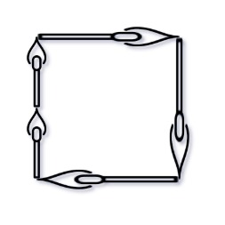

# 473. Matchsticks to Square


## Level - medium


## Task
You are given an integer array matchsticks where matchsticks[i] is the length of the i^th matchstick. 
You want to use all the matchsticks to make one square. 
You should not break any stick, but you can link them up, and each matchstick must be used exactly one time.

Return true if you can make this square and false otherwise.


## Объяснение
Что требуется сделать:
Даны спички с разными длинами. 
Нужно использовать ВСЕ спички, чтобы собрать ОДИН квадрат. 
Спички нельзя ломать, но можно соединять. Каждая сторона квадрата должна быть одинаковой длины.

Подходы к решению:
- Backtracking (обратный поиск) - рекурсивно пробуем распределить каждую спичку по одной из четырёх сторон, откатываемся если решение невозможно
- DFS с сортировкой - сортируем спички по убыванию и пытаемся разместить самые длинные в первую очередь (сокращает ветвление)
- Bitmask DP - поскольку n ≤ 15, можно использовать битовую маску для запоминания посещённых состояний
- Жадный подход - пробуем класть спички на самую короткую сторону, которая может её вместить


## Example 1:

```
Input: matchsticks = [1,1,2,2,2]
Output: true
Explanation: You can form a square with length 2, one side of the square came two sticks with length 1.
```


## Example 2:
```
Input: matchsticks = [3,3,3,3,4]
Output: false
Explanation: You cannot find a way to form a square with all the matchsticks.
```


## Constraints:
- 1 <= matchsticks.length <= 15
- 1 <= matchsticks[i] <= 10^8