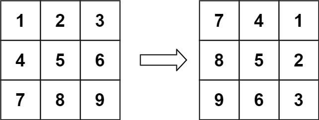
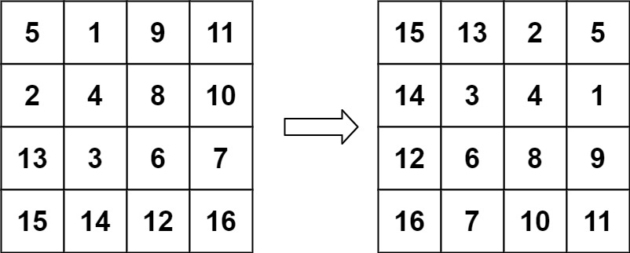

# 48. Rotate Image


## Level - medium


## Task
You are given an n x n 2D matrix representing an image, rotate the image by 90 degrees (clockwise).

You have to rotate the image in-place, which means you have to modify the input 2D matrix directly. 
DO NOT allocate another 2D matrix and do the rotation.


## Объяснение
Задача "48. Rotate Image" предполагает, что вы имеете квадратную матрицу, представляющую изображение, 
и вам нужно повернуть ее на 90 градусов по часовой стрелке.

Например, если у вас есть следующая матрица:
````
1 2 3
4 5 6
7 8 9
````

После поворота на 90 градусов по часовой стрелке она будет выглядеть так:
````
7 4 1
8 5 2
9 6 3
````

Это простое преобразование может быть выполнено несколькими способами, 
но один из самых эффективных - это поворот матрицы на 90 градусов, затем реверс каждой строки.


## Example 1:

````
Input: matrix = [[1,2,3],[4,5,6],[7,8,9]]
Output: [[7,4,1],[8,5,2],[9,6,3]]
````


## Example 2:

````
Input: matrix = [[5,1,9,11],[2,4,8,10],[13,3,6,7],[15,14,12,16]]
Output: [[15,13,2,5],[14,3,4,1],[12,6,8,9],[16,7,10,11]]
````


## Constraints:
- n == matrix.length == matrix[i].length
- 1 <= n <= 20
- -1000 <= matrix[i][j] <= 1000