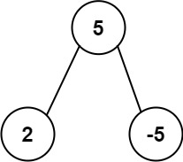

# 508. Most Frequent Subtree Sum


## Level - medium


## Task
Given the root of a binary tree, return the most frequent subtree sum. If there is a tie, return all the values with the highest frequency in any order.

The subtree sum of a node is defined as the sum of all the node values formed by the subtree rooted at that node (including the node itself).


## Объяснение

### Постановка задачи:
1. **Сумма поддерева** - это сумма значений всех узлов в поддереве, включая корень этого поддерева
2. **Наиболее частая сумма** - это сумма, которая встречается чаще всего среди всех сумм поддеревьев
3. Если несколько сумм имеют одинаковую максимальную частоту, возвращаем все такие суммы
4. Примеры:
   - Для дерева [5,2,-3]:
     * Сумма поддерева для узла 2: 2
     * Сумма поддерева для узла -3: -3 
     * Сумма поддерева для узла 5: 5 + 2 + (-3) = 4
     * Результат: [2, -3, 4] (все суммы встречаются по 1 разу)

### Подходы к решению:

#### 1. Рекурсивный пост-ордерный обход (ver1_hash_map.go)
- **Идея**: Рекурсивно вычисляем сумму каждого поддерева (значение узла + суммы левого и правого поддеревьев)
- **Сложность**: O(n) по времени и памяти
- **Плюсы**: Простота реализации, естественный для деревьев подход
- **Минусы**: Риск переполнения стека для очень больших деревьев

#### 2. Итеративный пост-ордерный обход (ver2_stack.go) 
- **Идея**: Используем стек для эмуляции рекурсии, сохраняем узлы с флагом посещения
- **Сложность**: O(n) по времени и памяти
- **Плюсы**: Нет риска переполнения стека
- **Минусы**: Более сложная логика обхода

#### 3. BFS с мемоизацией (ver3_bfs.go)
- **Идея**: Обход в ширину с сохранением сумм поддеревьев в отдельной карте
- **Сложность**: O(n) по времени и памяти  
- **Плюсы**: Альтернативный подход, может быть полезен для специфичных случаев
- **Минусы**: Требует дополнительной памяти для хранения сумм

### Рекомендации:
- Для большинства случаев лучше использовать рекурсивный или итеративный пост-ордерный обход
- BFS-подход может быть полезен, если нужно параллельно решать другие задачи обхода


## Example 1

```
Input: root = [5,2,-3]
Output: [2,-3,4]
```


## Example 2:

```
Input: root = [5,2,-5]
Output: [2]
```


## Constraints:
- The number of nodes in the tree is in the range [1, 10^4].
- -10^5 <= Node.val <= 10^5