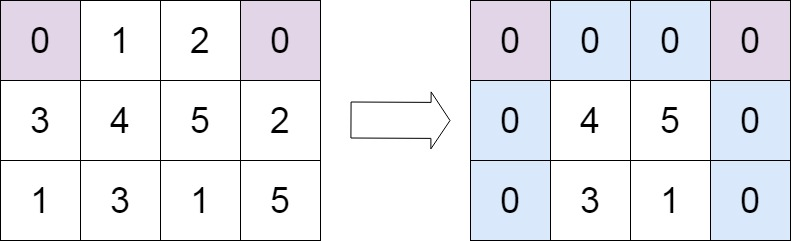

# 73. Set Matrix Zeroes


## Level - medium


## Task
Given an m x n integer matrix matrix, if an element is 0, set its entire row and column to 0's.

You must do it in place.


## Объяснение
Дан массив m x n, состоящий из элементов, которые являются целыми числами. 
Ваша задача - если элемент в массиве равен 0, то заменить всю строку и всю колонку, в которой находится этот элемент, на 0.
Например, если у вас есть массив:
````
1 1 1
1 0 1
1 1 1
````

После преобразования массив должен выглядеть так:
````
1 0 1
0 0 0
1 0 1
````

Ваша задача - реализовать функцию, которая будет принимать такой массив и возвращать преобразованный массив.

Одним из возможных решений является использование дополнительного пространства, чтобы отметить строки и столбцы, которые нужно обнулить. 
После того, как вы отметили все нужные строки и столбцы, вы можете пройтись по ним еще раз и обнулить их.


## Example 1:

````
Input: matrix = [[1,1,1],[1,0,1],[1,1,1]]
Output: [[1,0,1],[0,0,0],[1,0,1]]
````

## Example 2:

````
Input: matrix = [[0,1,2,0],[3,4,5,2],[1,3,1,5]]
Output: [[0,0,0,0],[0,4,5,0],[0,3,1,0]]
````


## Constraints:
- m == matrix.length
- n == matrix[0].length
- 1 <= m, n <= 200
- -2^31 <= matrix[i][j] <= 2^31 - 1


## Follow up:
- A straightforward solution using O(mn) space is probably a bad idea.
- A simple improvement uses O(m + n) space, but still not the best solution.
- Could you devise a constant space solution?