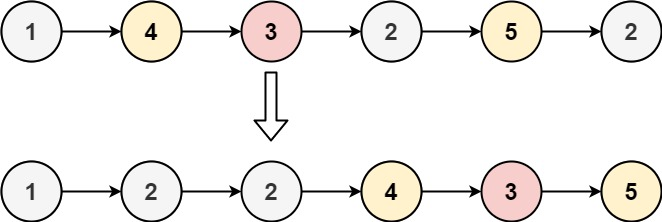

# 86. Partition List


## Level - medium


## Task
Given the head of a linked list and a value x, partition it such that all nodes less than x come before nodes greater than or equal to x.

You should preserve the original relative order of the nodes in each of the two partitions.


## Объяснение
Задача предлагает вам разделить связный список на две части таким образом, чтобы все узлы, значения которых меньше заданного значения x, 
оказались перед узлами, значения которых больше или равны x.

Для решения этой задачи, вам нужно будет пройти по списку и разделить его на две части: одну, где все узлы меньше x, 
и другую, где все узлы больше или равны x. Затем, вам нужно будет объединить эти две части.


## Example 1:

````
Input: head = [1,4,3,2,5,2], x = 3
Output: [1,2,2,4,3,5]
````


## Example 2:
````
Input: head = [2,1], x = 2
Output: [1,2]
````


## Constraints:
- The number of nodes in the list is in the range [0, 200].
- -100 <= Node.val <= 100
- -200 <= x <= 200