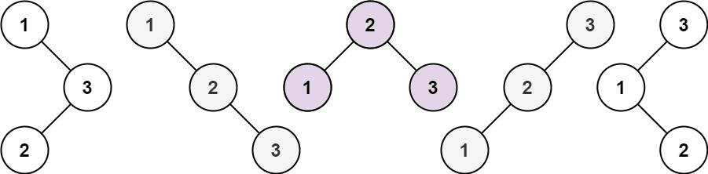

# 95. Unique Binary Search Trees II


## Level - medium


## Task
Given an integer n, return all the structurally unique BST's (binary search trees), 
which has exactly n nodes of unique values from 1 to n. Return the answer in any order.


## Объяснение
Задача заключается в том, чтобы создать все возможные уникальные двоичные деревья поиска (BST) для заданного набора чисел от 1 до n.

Дерево поиска является двоичным деревом, в котором для каждого узла все значения в левом поддереве меньше значения узла, 
а все значения в правом поддереве больше значения узла.

Например, если n = 3, тогда существует 5 уникальных BST, представленных ниже:
````
  1         3     3      2      1
   \       /     /      / \      \
    3     2     1      1   3      2
   /     /       \                 \
  2     1         2                 3
````

Решение этой задачи может быть реализовано с помощью рекурсивного подхода, 
где для каждого числа i из диапазона [1, n] мы генерируем все возможные левое и правое поддеревья, 
а затем объединяем их с корнем i.

Также важно отметить, что для каждого поддерева нужно будет сохранять его представление, чтобы избежать повторений. 
Это можно сделать, например, с помощью хэширования или сериализации дерева.


## Example 1:

````
Input: n = 3
Output: [[1,null,2,null,3],[1,null,3,2],[2,1,3],[3,1,null,null,2],[3,2,null,1]]
````


## Example 2:
````
Input: n = 1
Output: [[1]]
````


## Constraints:
- 1 <= n <= 8