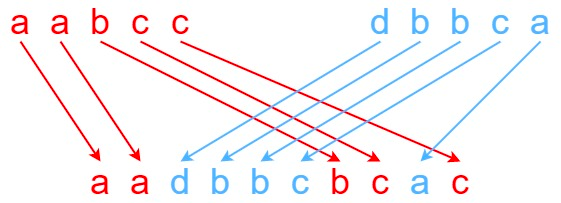

# 97. Interleaving String


## Level - medium


## Task
Given strings s1, s2, and s3, find whether s3 is formed by an interleaving of s1 and s2.

An interleaving of two strings s and t is a configuration where s and t are divided into n and m
substrings respectively, such that:
- s = s1 + s2 + ... + sn
- t = t1 + t2 + ... + tm
- |n - m| <= 1
- The interleaving is s1 + t1 + s2 + t2 + s3 + t3 + ... or t1 + s1 + t2 + s2 + t3 + s3 + ...

Note: a + b is the concatenation of strings a and b.


## Объяснение
Задача заключается в том, чтобы определить, можно ли получить строку s3 путем взаимного объединения двух других строк s1 и s2. 
Взаимное объединение означает, что строка s3 должна быть результатом взаимного объединения символов из s1 и s2, 
при этом порядок символов в s1 и s2 должен быть сохранен.

Например, если s1 = "aabcc", s2 = "dbbca", и s3 = "aadbbcbcac", тогда ответ будет "true", 
потому что s3 можно получить путем взаимного объединения s1 и s2.

Если же s1 = "aabcc", s2 = "dbbca", и s3 = "aadbbbaccc", тогда ответ будет "false", 
потому что не существует такого взаимного объединения, которое бы дало бы s3.

Решение этой задачи может быть реализовано с помощью динамического программирования, где мы будем отслеживать, 
можно ли получить подстроку s3 из подстрок s1 и s2.


## Example 1:

````
Input: s1 = "aabcc", s2 = "dbbca", s3 = "aadbbcbcac"
Output: true
Explanation: One way to obtain s3 is:
Split s1 into s1 = "aa" + "bc" + "c", and s2 into s2 = "dbbc" + "a".
Interleaving the two splits, we get "aa" + "dbbc" + "bc" + "a" + "c" = "aadbbcbcac".
Since s3 can be obtained by interleaving s1 and s2, we return true.
````


## Example 2:
````
Input: s1 = "aabcc", s2 = "dbbca", s3 = "aadbbbaccc"
Output: false
Explanation: Notice how it is impossible to interleave s2 with any other string to obtain s3.
````


## Example 3:
````
Input: s1 = "", s2 = "", s3 = ""
Output: true
````


## Constraints:
- 0 <= s1.length, s2.length <= 100
- 0 <= s3.length <= 200
- s1, s2, and s3 consist of lowercase English letters.

Follow up: Could you solve it using only O(s2.length) additional memory space?