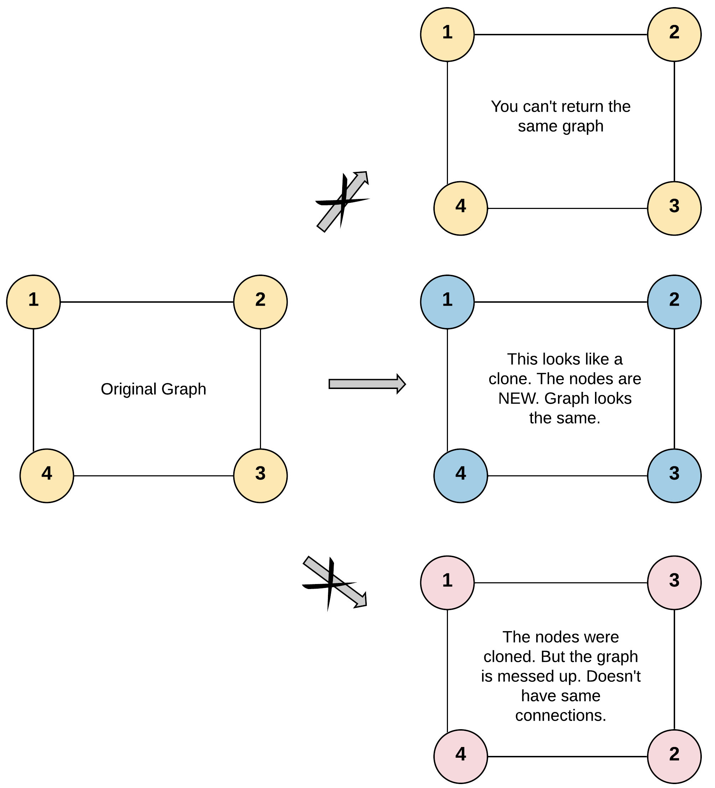

# 133. Clone Graph


## Level - medium


## Task
Given a reference of a node in a connected undirected graph.

Return a deep copy (clone) of the graph.

Each node in the graph contains a value (int) and a list (List[Node]) of its neighbors.
````
class Node {
public int val;
public List<Node> neighbors;
}
````


## Test case format:
For simplicity, each node's value is the same as the node's index (1-indexed). 
For example, the first node with val == 1, the second node with val == 2, and so on. 
The graph is represented in the test case using an adjacency list.

An adjacency list is a collection of unordered lists used to represent a finite graph. 
Each list describes the set of neighbors of a node in the graph.

The given node will always be the first node with val = 1. 
You must return the copy of the given node as a reference to the cloned graph.


## Объяснение
Задача заключается в создании глубокой копии неориентированного графа, 
где каждый узел содержит уникальное значение. 
Каждый узел в графе может быть соединен с любым количеством других узлов.

Требуется написать функцию, которая будет принимать на вход указатель на узел графа и возвращать указатель на новый узел графа, 
который является глубокой копией исходного графа.

Глубокая копия графа должна быть такой, чтобы все узлы в новом графе были новыми объектами, 
а связи между узлами соответствовали оригинальным связям. 
То есть, если узел A в оригинальном графе был связан с узлом B, то в новом графе узлы A и B также должны быть связаны.

Важно отметить, что граф может содержать циклы, и поэтому при копировании необходимо учитывать, чтобы узлы, 
которые уже были скопированы, не копировались повторно, чтобы избежать бесконечного цикла.


## Example 1:

````
Input: adjList = [[2,4],[1,3],[2,4],[1,3]]
Output: [[2,4],[1,3],[2,4],[1,3]]
Explanation: There are 4 nodes in the graph.
1st node (val = 1)'s neighbors are 2nd node (val = 2) and 4th node (val = 4).
2nd node (val = 2)'s neighbors are 1st node (val = 1) and 3rd node (val = 3).
3rd node (val = 3)'s neighbors are 2nd node (val = 2) and 4th node (val = 4).
4th node (val = 4)'s neighbors are 1st node (val = 1) and 3rd node (val = 3).
````

## Example 2:

````
Input: adjList = [[]]
Output: [[]]
Explanation: Note that the input contains one empty list. The graph consists of only one node with val = 1 and it does not have any neighbors.
````

## Example 3:
````
Input: adjList = []
Output: []
Explanation: This an empty graph, it does not have any nodes.
````


## Constraints:
- The number of nodes in the graph is in the range [0, 100].
- 1 <= Node.val <= 100
- Node.val is unique for each node.
- There are no repeated edges and no self-loops in the graph.
- The Graph is connected and all nodes can be visited starting from the given node.