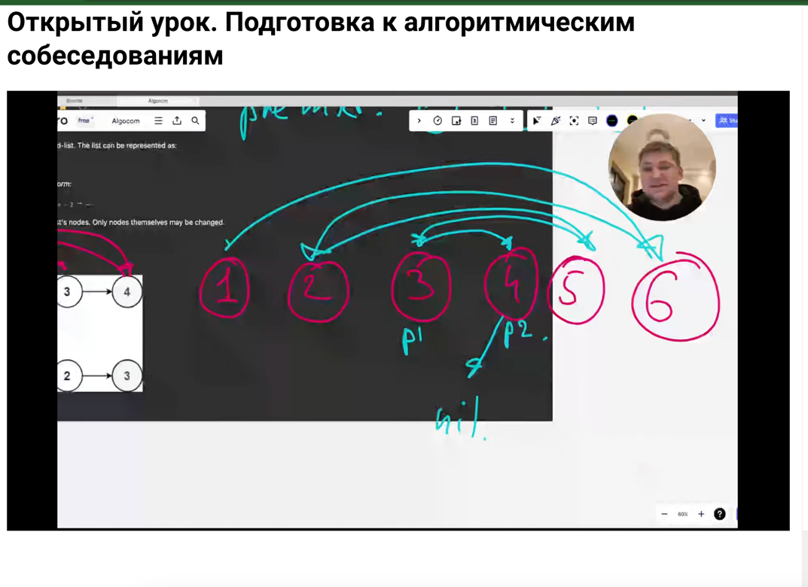
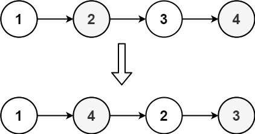
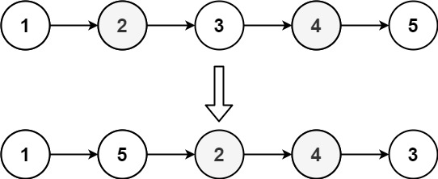

# 143. Reorder List


## Level - Medium


## Task
You are given the head of a singly linked-list. The list can be represented as:
L0 → L1 → … → Ln - 1 → Ln

Reorder the list to be on the following form:
L0 → Ln → L1 → Ln - 1 → L2 → Ln - 2 → 

You may not modify the values in the list's nodes. Only nodes themselves may be changed.


## РЕШЕНИЕ НА КАРТИНКЕ



## ЧТО ТАКОЕ МЕТОД ПОМОДОРА
Метод помодора (Hoare partition scheme) - это метод, используемый для разделения массива на две части. 
Он основан на разделении массива на две части таким образом, 
что элементы в левой части меньше или равны опорному элементу, а элементы в правой части больше опорного элемента.
Основная идея метода помодора заключается в том, чтобы выбрать опорный элемент и разделить массив так, 
чтобы все элементы меньше опорного оказались слева, а все элементы больше опорного оказались справа.


## Example 1:

````
Input: head = [1,2,3,4]
Output: [1,4,2,3]
````

## Example 2:

````
Input: head = [1,2,3,4,5]
Output: [1,5,2,4,3]
````


## Constraints:
- The number of nodes in the list is in the range [1, 5 * 104].
- 1 <= Node.val <= 1000