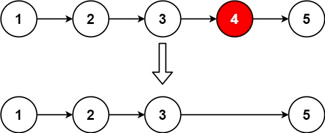

# 19. Remove Nth Node From End of List


## Level - Medium


## Task
Given the head of a linked list, remove the nth node from the end of the list and return its head.


## Объяснение
В этой задаче вам нужно удалить n-й узел из конца связанного списка и вернуть его голову.
Вам нужно написать функцию, которая принимает на вход голову связанного списка и число n, 
а затем удаляет n-й узел с конца списка.

Например, если вы вводите список [1, 2, 3, 4, 5] и n = 2, ваша функция должна вернуть список [1, 2, 3, 5].

Если вы вводите список [1] и n = 1, ваша функция должна вернуть пустой список [].
Ваша функция должна работать для любого списка и любого числа n, которые вы передадите ей.


## КАК МОЖНО РЕШАТЬ?
Для решения задачи "Remove Nth Node From End of List" можно использовать следующие подходы:

1. Двухпроходной подход. 
В этом подходе вы сначала проходитесь по связанному списку, чтобы найти его длину. 
Затем вы вычисляете индекс узла, который нужно удалить (это длина - n). 
После этого вы проходитесь по списку еще раз, удаляя нужный узел.

2. Однопроходной подход. 
В этом подходе вы используете два указателя. 
Первый указатель находится на расстоянии n от начала списка, а второй указатель находится в начале списка. 
Затем вы перемещаете оба указателя одновременно, пока первый указатель не достигнет конца списка. 
В этот момент второй указатель будет находиться на расстоянии n от конца списка, и вы можете удалить его.

3. Стековый подход. 
В этом подходе вы проходитесь по связанному списку и помещаете все узлы в стек. 
Затем вы извлекаете n узлов из стека. Узел, следующий за извлеченным узлом, является узлом, который нужно удалить.

4. Рекурсивный подход. 
В этом подходе вы используете рекурсию для достижения конца списка, а затем удаляете n-й узел.


## Example 1:

````
Input: head = [1,2,3,4,5], n = 2
Output: [1,2,3,5]
````

## Example 2:
````
Input: head = [1], n = 1
Output: []
````

## Example 3:
````
Input: head = [1,2], n = 1
Output: [1]
````


## Constraints:
- The number of nodes in the list is sz.
- 1 <= sz <= 30
- 0 <= Node.val <= 100
- 1 <= n <= sz

Follow up: Could you do this in one pass?