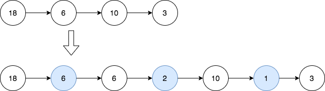

# 2807. Insert Greatest Common Divisors in Linked List


## Level - medium


## Task
Given the head of a linked list head, in which each node contains an integer value.

Between every pair of adjacent nodes, insert a new node with a value equal to the greatest common divisor of them.

Return the linked list after insertion.

The greatest common divisor of two numbers is the largest positive integer that evenly divides both numbers.


## Что надо сделать?
В задаче требуется вставлять в связанный список новые узлы, значение которых является наибольшим общим делителем (НОД) двух соседних узлов.

НОД - это наибольшее число, на которое делятся два других числа без остатка. Например, НОД чисел 12 и 18 - это 6, 
потому что 12 и 18 делятся на 6 без остатка.

Таким образом, вам нужно пройти по связанному списку, для каждой пары соседних узлов вычислить их НОД, 
и вставить новый узел с этим значением между этими узлами.

Например, если у вас был список 1 -> 2 -> 3 -> 4 -> 5, после вставки НОД, он должен стать 1 -> 1 -> 2 -> 1 -> 3 -> 1 -> 4 -> 1 -> 5.

Ваша функция должна возвращать новую голову списка.


## Example 1:

````
Input: head = [18,6,10,3]
Output: [18,6,6,2,10,1,3]
Explanation: The 1st diagram denotes the initial linked list and the 2nd diagram denotes the linked list after inserting the new nodes (nodes in blue are the inserted nodes).
- We insert the greatest common divisor of 18 and 6 = 6 between the 1st and the 2nd nodes.
- We insert the greatest common divisor of 6 and 10 = 2 between the 2nd and the 3rd nodes.
- We insert the greatest common divisor of 10 and 3 = 1 between the 3rd and the 4th nodes.
There are no more adjacent nodes, so we return the linked list.
````


## Example 2:

````
Input: head = [7]
Output: [7]
Explanation: The 1st diagram denotes the initial linked list and the 2nd diagram denotes the linked list after inserting the new nodes.
There are no pairs of adjacent nodes, so we return the initial linked list.
````


## Constraints:
- The number of nodes in the list is in the range [1, 5000].
- 1 <= Node.val <= 1000
