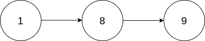
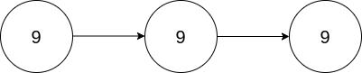

# 2816. Double a Number Represented as a Linked List


## Level - medium


## Task
You are given the head of a non-empty linked list representing a non-negative integer without leading zeroes.

Return the head of the linked list after doubling it.


## Объяснение
Основная идея метода заключается в том, чтобы удвоить значение каждого узла в списке, 
если его значение меньше 5, и удвоить значение и прибавить 1, если значение узла больше или равно 5.

Если значение первого узла больше или равно 5, то создается новый узел со значением 1 
и он становится первым узлом списка.


## Example 1:

````
Input: head = [1,8,9]
Output: [3,7,8]
Explanation: The figure above corresponds to the given linked list which represents the number 189. Hence, the returned linked list represents the number 189 * 2 = 378.
````


## Example 2:

````
Input: head = [9,9,9]
Output: [1,9,9,8]
Explanation: The figure above corresponds to the given linked list which represents the number 999. Hence, the returned linked list reprersents the number 999 * 2 = 1998.
````


## Constraints:
- The number of nodes in the list is in the range [1, 104]
- 0 <= Node.val <= 9
- The input is generated such that the list represents a number that does not have leading zeros, except the number 0 itself.