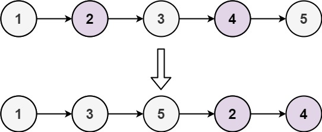
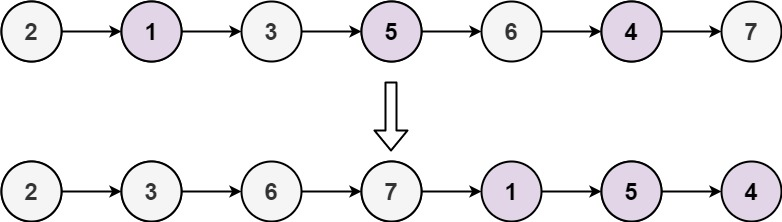

# 328. Odd Even Linked List


## Level - medium


## Task
Given the head of a singly linked list, group all the nodes with odd indices together followed by the nodes with even indices, and return the reordered list.

The first node is considered odd, and the second node is even, and so on.

Note that the relative order inside both the even and odd groups should remain as it was in the input.

You must solve the problem in O(1) extra space complexity and O(n) time complexity.


## Объяснение
Задача предполагает, что вы работаете с связным списком, где каждый узел содержит целое число. 
Ваша задача - разделить список на два: один, содержащий только нечетные числа, и другой, содержащий только четные числа. 
Порядок элементов в новых списках должен быть таким же, как и в исходном списке.


Например, если у вас есть список 1 -> 2 -> 3 -> 4 -> 5 -> NULL, 
после разделения он должен стать 1 -> 3 -> 5 -> NULL (нечетные) и 2 -> 4 -> NULL (четные).

Обратите внимание, что порядок элементов в новых списках должен быть таким же, как и в исходном списке. 
Это означает, что вы не можете просто удалить нечетные или четные элементы из исходного списка, 
а необходимо создать два новых списка, каждый из которых будет содержать только нечетные или четные элементы соответственно.

Также важно отметить, что исходный список должен оставаться неизменным. 
Это означает, что вы не должны изменять значения узлов в исходном списке, 
а должны создавать новые узлы и связывать их в новые списки.


## Example 1:

````
Input: head = [1,2,3,4,5]
Output: [1,3,5,2,4]
````


## Example 2:

````
Input: head = [2,1,3,5,6,4,7]
Output: [2,3,6,7,1,5,4]
````


## Constraints:
- The number of nodes in the linked list is in the range [0, 10^4].
- -10^6 <= Node.val <= 10^6