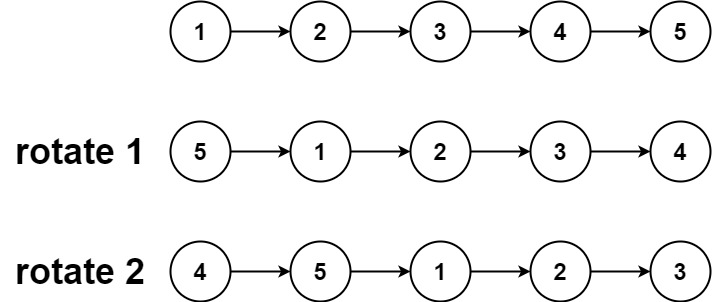
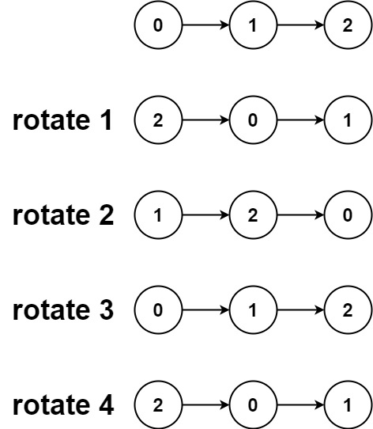

# 61. Rotate List


## Level - medium


## Task
Given the head of a linked list, rotate the list to the right by k places.


## Example 1:

````
Input: head = [1,2,3,4,5], k = 2
Output: [4,5,1,2,3]
````


## Example 2:

````
Input: head = [0,1,2], k = 4
Output: [2,0,1]
````


## Constraints:
- The number of nodes in the list is in the range [0, 500].
- -100 <= Node.val <= 100
- 0 <= k <= 2 * 109