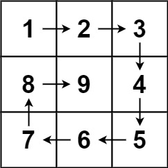

# 59. Spiral Matrix II


## Level - medium


## Task
Given a positive integer n, generate an n x n matrix filled with elements from 1 to n^2 in spiral order.


## Объяснение

Задача предполагает создание двумерной матрицы размера n x n, заполненной по спирали, начиная с 1 в левом верхнем углу 
и заканчивая n * n в правом нижнем углу.

Чтобы решить эту задачу, можно использовать итеративный подход, где вы будете двигаться по спирали 
и заполнять матрицу по часовой стрелке.


## Example 1:

````
Input: n = 3
Output: [[1,2,3],[8,9,4],[7,6,5]]
````


## Example 2:
````
Input: n = 1
Output: [[1]]
````

## Constraints:
- 1 <= n <= 20