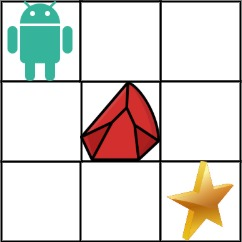

# 63. Unique Paths II


## Level - medium


## Task
You are given an m x n integer array grid. There is a robot initially located at the top-left corner (i.e., grid[0][0]). 
The robot tries to move to the bottom-right corner (i.e., grid[m - 1][n - 1]). 
The robot can only move either down or right at any point in time.

An obstacle and space are marked as 1 or 0 respectively in grid. 
A path that the robot takes cannot include any square that is an obstacle.

Return the number of possible unique paths that the robot can take to reach the bottom-right corner.

The testcases are generated so that the answer will be less than or equal to 2 * 10^9.


## Объяснение
Это задача на динамическое программирование, которая заключается в нахождении количества уникальных путей от верхнего левого угла до нижнего правого угла в двумерной сетке, 
представленной матрицей, где есть возможность двигаться только вниз или вправо. 
Однако, в этой сетке есть некоторые клетки, заблокированные (обозначенные как 1), которые нельзя проходить.

Чтобы решить эту задачу, можно использовать динамическое программирование. 
Создайте матрицу dp, где dp[i][j] будет представлять количество уникальных путей до клетки (i, j). 
Инициализируйте dp[0][0] как 1, если начальная клетка не заблокирована, иначе 0. 
Затем заполните матрицу dp по следующим правилам:
1. Если клетка (i, j) не заблокирована, то dp[i][j] = dp[i-1][j] + dp[i][j-1], если i и j больше 0.
2. Если клетка (i, j) заблокирована, то dp[i][j] = 0.

После того, как матрица dp будет заполнена, dp[m-1][n-1] будет содержать количество уникальных путей до нижнего правого угла.


## Example 1:

````
Input: obstacleGrid = [[0,0,0],[0,1,0],[0,0,0]]
Output: 2
Explanation: There is one obstacle in the middle of the 3x3 grid above.
There are two ways to reach the bottom-right corner:
1. Right -> Right -> Down -> Down
2. Down -> Down -> Right -> Right
````

## Example 2:

````
Input: obstacleGrid = [[0,1],[0,0]]
Output: 1
````


## Constraints:
- m == obstacleGrid.length
- n == obstacleGrid[i].length
- 1 <= m, n <= 100
- obstacleGrid[i][j] is 0 or 1.