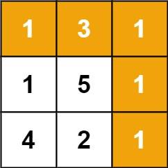

# 64. Minimum Path Sum


## Level - medium


## Task
Given a m x n grid filled with non-negative numbers, find a path from top left to bottom right, which minimizes the sum of all numbers along its path.

Note: You can only move either down or right at any point in time.


## Объяснение
Задача заключается в нахождении минимальной суммы пути от верхнего левого угла до нижнего правого угла в двумерном массиве. 
Вы можете перемещаться только вниз или вправо.

Чтобы решить эту задачу, можно использовать динамическое программирование. 
Можно создать новый массив, где каждый элемент будет представлять минимальную сумму пути до этой точки. 
Затем мы заполним этот массив, используя информацию из исходного массива и предыдущих вычислений.


## Example 1:

````
Input: grid = [[1,3,1],[1,5,1],[4,2,1]]
Output: 7
Explanation: Because the path 1 → 3 → 1 → 1 → 1 minimizes the sum.
````


## Example 2:
````
Input: grid = [[1,2,3],[4,5,6]]
Output: 12
````


## Constraints:
- m == grid.length
- n == grid[i].length
- 1 <= m, n <= 200
- 0 <= grid[i][j] <= 200