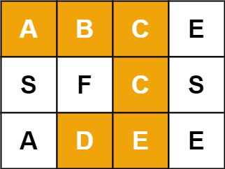
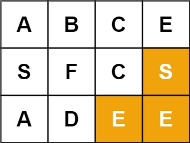
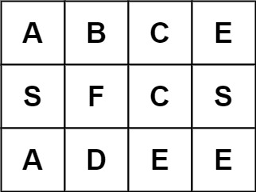

# 79. Word Search


## Level - medium


## Task
Given an m x n grid of characters board and a string word, return true if word exists in the grid.

The word can be constructed from letters of sequentially adjacent cells, where adjacent cells are horizontally or vertically neighboring. 
The same letter cell may not be used more than once.


## Объяснение
Это задача на поиск слова в двумерном массиве символов. 
Вам нужно найти, существует ли данное слово в массиве, двигаясь по соседним ячейкам (горизонтально или вертикально, но не по диагонали).

````
board = [
['A','B','C','E'],
['S','F','C','S'],
['A','D','E','E']
]
````

word = "ABCCED"

Обратите внимание, что каждая буква может быть использована только один раз.

Ваша задача - реализовать функцию, которая будет решать эту задачу.


## Example 1:

````
Input: board = [["A","B","C","E"],["S","F","C","S"],["A","D","E","E"]], word = "ABCCED"
Output: true
````


## Example 2:

````
Input: board = [["A","B","C","E"],["S","F","C","S"],["A","D","E","E"]], word = "SEE"
Output: true
````


## Example 3:

````
Input: board = [["A","B","C","E"],["S","F","C","S"],["A","D","E","E"]], word = "ABCB"
Output: false
````


## Constraints:
- m == board.length
- n = board[i].length
- 1 <= m, n <= 6
- 1 <= word.length <= 15
- board and word consists of only lowercase and uppercase English letters.


Follow up: Could you use search pruning to make your solution faster with a larger board?