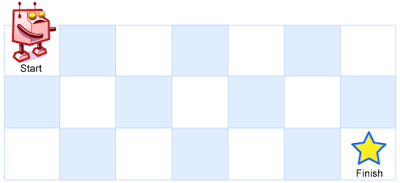

# 62. Unique Paths


## Level - medium


## Task
There is a robot on an m x n grid. The robot is initially located at the top-left corner (i.e., grid[0][0]). 
The robot tries to move to the bottom-right corner (i.e., grid[m - 1][n - 1]). 
The robot can only move either down or right at any point in time.

Given the two integers m and n, return the number of possible unique paths that the robot can take to reach the bottom-right corner.

The test cases are generated so that the answer will be less than or equal to 2 * 10^9.


## Объяснение
Это задача на динамическое программирование, 
которая заключается в нахождении количества уникальных путей от верхнего левого угла до нижнего правого угла в двумерной сетке.

В этой сетке есть препятствия, которые представлены как 1, а пустые клетки - как 0. 
Начиная с левого верхнего угла сетки (0,0), наша задача - добраться до правого нижнего угла (m-1, n-1), 
двигаясь только вниз или вправо, не проходя через препятствия.

При решении этой задачи мы можем использовать динамическое программирование, создав двумерный массив dp, 
где dp[i][j] будет представлять количество уникальных путей до клетки (i, j). 
Начальное значение dp[0][0] будет равно 1, так как из начальной клетки можно попасть в один путь.

Для всех остальных клеток, если они не являются препятствиями (grid[i][j] == 0), 
мы можем обновить их значение в dp как сумму значений dp из клеток сверху и слева (если они существуют).

В конце мы вернем значение dp[m-1][n-1], которое будет представлять количество уникальных путей до правого нижнего угла.

Таким образом, задача сводится к нахождению количества путей в двумерной сетке с препятствиями, 
используя динамическое программирование.


## Example 1:

````
Input: m = 3, n = 7
Output: 28
````

## Example 2:
````
Input: m = 3, n = 2
Output: 3
Explanation: From the top-left corner, there are a total of 3 ways to reach the bottom-right corner:
1. Right -> Down -> Down
2. Down -> Down -> Right
3. Down -> Right -> Down
````


## Constraints:
- 1 <= m, n <= 100