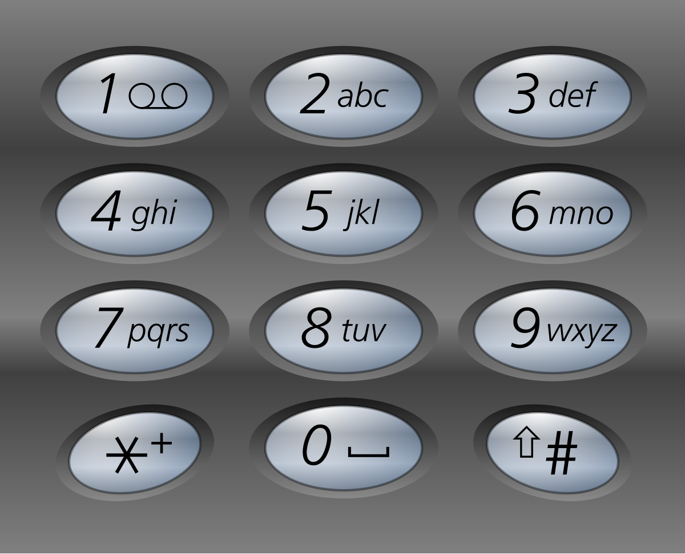

# 17. Letter Combinations of a Phone Number


## Level - medium


## Task
Given a string containing digits from 2-9 inclusive, return all possible letter combinations that the number could represent. 
Return the answer in any order.

A mapping of digits to letters (just like on the telephone buttons) is given below. Note that 1 does not map to any letters.




## Объяснение
Задача заключается в том, чтобы найти все возможные комбинации букв, которые могут быть получены нажатием цифр на клавиатуре телефона.

Например, если вводится цифра "2", то на клавиатуре телефона это соответствует буквы "a", "b" и "c". 
Если вводится цифра "3", то на клавиатуре телефона это соответствует буквы "d", "e" и "f".

Таким образом, если вводится цифра "23", то на клавиатуре телефона это соответствует буквы "ad", "ae", "af", "bd", "be", "bf", "cd", "ce", "cf".

Таким образом, вам нужно написать функцию, которая будет принимать в качестве аргумента строку цифр, 
и возвращать список всех возможных комбинаций букв, которые могут быть получены нажатием этих цифр.


## Example 1:
````
Input: digits = "23"
Output: ["ad","ae","af","bd","be","bf","cd","ce","cf"
````

## Example 2:
````
Input: digits = ""
Output: []
````

## Example 3:
````
Input: digits = "2"
Output: ["a","b","c"]
````


## Constraints:
- 0 <= digits.length <= 4
- digits[i] is a digit in the range ['2', '9'].