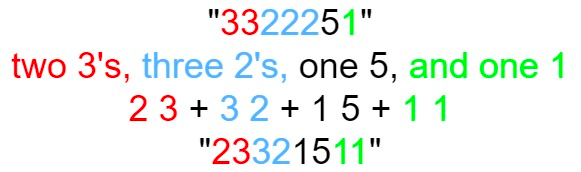

# 38. Count and Say


## Level - medium


## Task
The count-and-say sequence is a sequence of digit strings defined by the recursive formula:
- countAndSay(1) = "1"
- countAndSay(n) is the way you would "say" the digit string from countAndSay(n-1), which is then converted into a different digit string.

To determine how you "say" a digit string, split it into the minimal number of substrings such that each substring contains exactly one unique digit. 
Then for each substring, say the number of digits, then say the digit. Finally, concatenate every said digit.

For example, the saying and conversion for digit string "3322251":


Given a positive integer n, return the nth term of the count-and-say sequence.


## Объяснение
Это популярная задача на программирование, которая заключается в следующем:

Начиная с числа 1, вы должны описать предыдущее число. 
Для примера, если предыдущее число было 11, то текущее число должно быть описано как "21", 
так как предыдущее число состоит из двух единиц.

Если предыдущее число было 21, то текущее число должно быть описано как "1211", 
так как предыдущее число состоит из одной двойки и одной единицы.

Таким образом, вы должны повторять этот процесс n раз, где n - входное число.

Задача часто используется для проверки навыков работы с цифрами и строками в программировании.


## Example 1:
````
Input: n = 1
Output: "1"
Explanation: This is the base case.
````


## Example 2:
````
Input: n = 4
Output: "1211"
Explanation:
countAndSay(1) = "1"
countAndSay(2) = say "1" = one 1 = "11"
countAndSay(3) = say "11" = two 1's = "21"
countAndSay(4) = say "21" = one 2 + one 1 = "12" + "11" = "1211"
````

## Constraints:
- 1 <= n <= 30