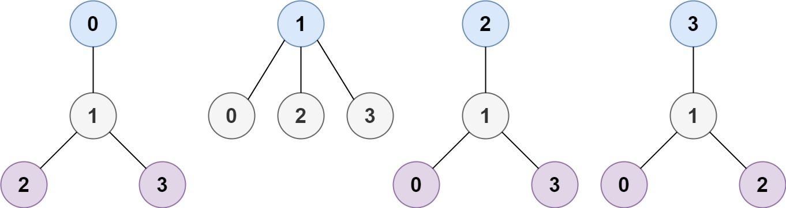
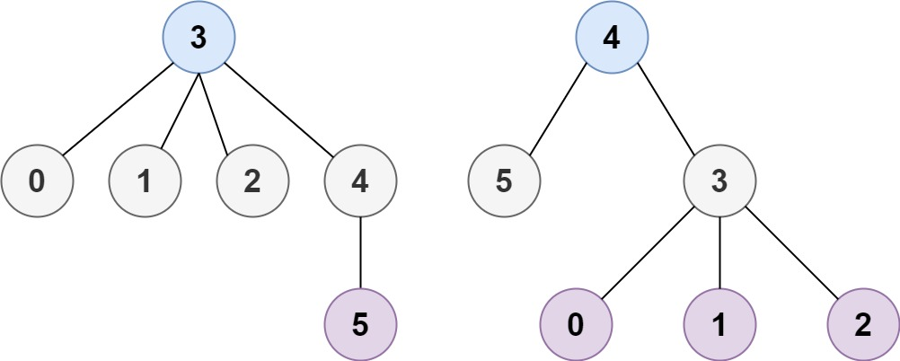

# 310. Minimum Height Trees


## Level - medium


## Task
A tree is an undirected graph in which any two vertices are connected by exactly one path. 
In other words, any connected graph without simple cycles is a tree.

Given a tree of n nodes labelled from 0 to n - 1, and an array of n - 1 edges 
where edges[i] = [ai, bi] indicates that there is an undirected edge between the two nodes ai and bi in the tree, 
you can choose any node of the tree as the root. 
When you select a node x as the root, the result tree has height h. 
Among all possible rooted trees, those with minimum height (i.e. min(h))  are called minimum height trees (MHTs).


Return a list of all MHTs' root labels. You can return the answer in any order.

The height of a rooted tree is the number of edges on the longest downward path between the root and a leaf.


## Объяснение
Это задача на поиск в графе минимальных высотных деревьев. 
В графе n вершин связанных ребрами, мы ищем вершины, которые могут быть корнями дерева, 
при котором дерево будет иметь минимальную высоту.

Минимальная высота дерева - это количество ребер в самом длинном простом пути от корня до любой из его вершин.

Задача решается с помощью алгоритма поиска в ширину (BFS), который используется для поиска самого длинного пути в графе. 
Алгоритм начинается с поиска всех листьев в графе, а затем удаляет их и повторяет процесс до тех пор, пока не останется 1 или 2 вершины. 
Остающиеся вершины являются корнями минимальных высотных деревьев.

Минимальное высотное дерево (MHT) - это дерево, в котором все листья находятся на одном уровне, а высота дерева минимальна. 
В графе минимальное высотное дерево - это подмножество вершин, которое образует дерево, и все остальные вершины являются листьями.

Минимальное высотное дерево используется в различных алгоритмах и структурах данных, 
таких как алгоритмы построения минимальных остовных деревьев, алгоритмы построения минимальных оптимальных кодов Хаффмана, и т.д.

В задаче нам нужно найти корни минимальных высотных деревьев в неориентированном графе. 
Это означает, что нам нужно найти такие вершины, которые, если бы они были корнями, давали бы минимальное высотное дерево.


## Example 1:

````
Input: n = 4, edges = [[1,0],[1,2],[1,3]]
Output: [1]
Explanation: As shown, the height of the tree is 1 when the root is the node with label 1 which is the only MHT.
````


## Example 2:

````
Input: n = 6, edges = [[3,0],[3,1],[3,2],[3,4],[5,4]]
Output: [3,4]
````


## Constraints:
- 1 <= n <= 2 * 10^4
- edges.length == n - 1
- 0 <= ai, bi < n
- ai != bi
- All the pairs (ai, bi) are distinct.
- The given input is guaranteed to be a tree and there will be no repeated edges.