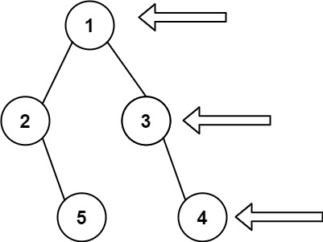

# 199. Binary Tree Right Side View


## Level - medium


## Task
Given the root of a binary tree, imagine yourself standing on the right side of it, 
return the values of the nodes you can see ordered from top to bottom.


## Объяснение
Задача заключается в том, чтобы создать список значений узлов, которые видны справа в бинарном дереве. 
То есть, для каждого уровня в дереве, мы должны взять только последний узел (самый правый).

Пример:
````
   1            <---
 /   \
2     3         <---
 \     \
  5     4       <---
````
Результат должен быть: [1, 3, 4].


## Example 1:

````
Input: root = [1,2,3,null,5,null,4]
Output: [1,3,4]
````


## Example 2:
````
Input: root = [1,null,3]
Output: [1,3]
````


## Example 3:
````
Input: root = []
Output: []
````


## Constraints:
- The number of nodes in the tree is in the range [0, 100].
- -100 <= Node.val <= 100