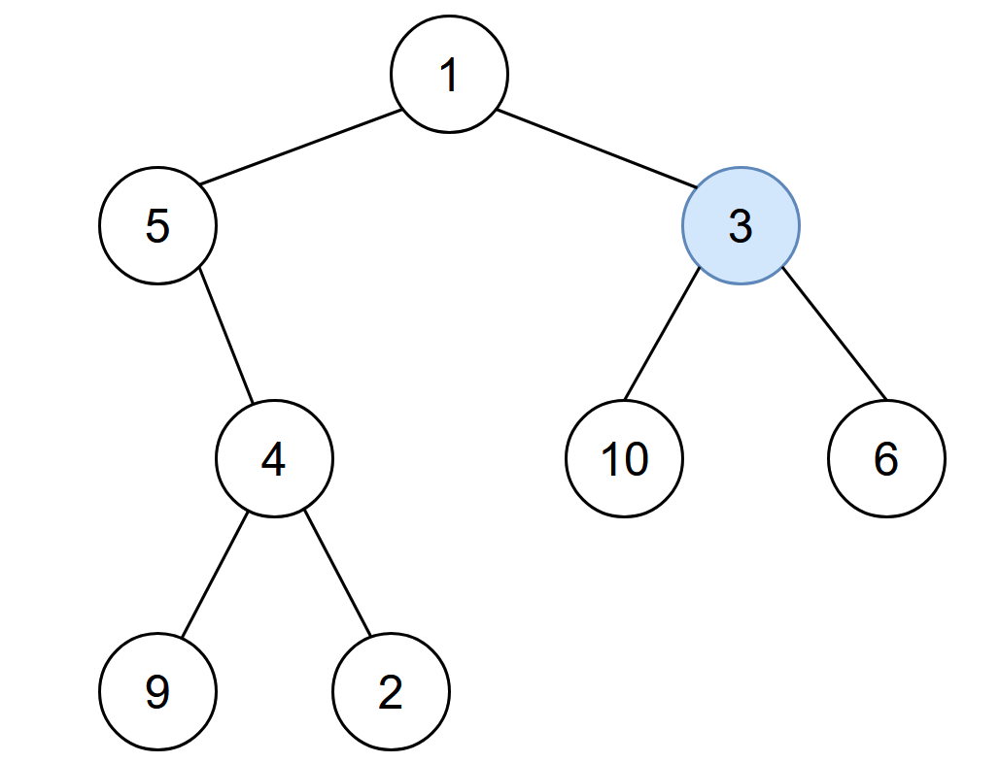

# 2385. Amount of Time for Binary Tree to Be Infected

## Level - medium

## Task
You are given the root of a binary tree with unique values, and an integer start. At minute 0, 
an infection starts from the node with value start.

Each minute, a node becomes infected if:
- The node is currently uninfected.
- The node is adjacent to an infected node.

Return the number of minutes needed for the entire tree to be infected.

## Объяснение
В задаче речь идет о поиске времени, необходимого для инфицирования всего дерева. 
Дерево может быть представлено в виде структуры данных, 
где каждый узел имеет значение (Val) и ссылки на левого и правого дочерних узлов (Left и Right).

Функция amountOfTimeV1 принимает на вход корень дерева и возвращает время, необходимое для инфицирования всего дерева. 
Время инфицирования определяется как количество единиц времени, необходимых для инфицирования всех узлов дерева. 
Каждый узел инфицируется за единицу времени, и время инфицирования узла равно максимальному из времени инфицирования его дочерних узлов плюс один.

## Example 1:

``
Input: root = [1,5,3,null,4,10,6,9,2], start = 3
Output: 4
Explanation: The following nodes are infected during:
- Minute 0: Node 3
- Minute 1: Nodes 1, 10 and 6
- Minute 2: Node 5
- Minute 3: Node 4
- Minute 4: Nodes 9 and 2
  It takes 4 minutes for the whole tree to be infected so we return 4.
``

## Example 2:

``
Input: root = [1], start = 1
Output: 0
Explanation: At minute 0, the only node in the tree is infected so we return 0.
``

## Constraints:
- The number of nodes in the tree is in the range [1, 10^5].
- 1 <= Node.val <= 105
- Each node has a unique value.
- A node with a value of start exists in the tree.