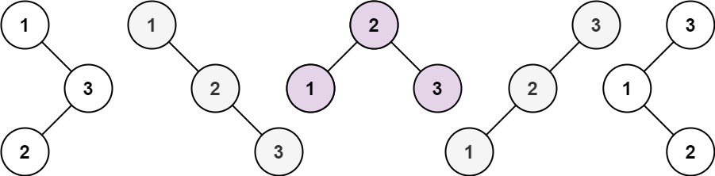

# 96. Unique Binary Search Trees

## Level - medium

## Task
Given an integer n, return the number of structurally unique BST's (binary search trees) which has exactly n nodes of unique values from 1 to n.

## Объяснение
Задача заключается в том, чтобы найти количество уникальных двоичных деревьев поиска, 
которые можно построить с заданным количеством узлов.

Двоичное дерево поиска (BST) - это дерево, в котором все узлы, лежащие в левом поддереве,
меньше корня, а все узлы, лежащие в правом поддереве, больше корня.

Для каждого количества узлов от 1 до n, мы должны найти количество уникальных BST, которые можно построить.

Например, если n = 3, то существует 5 уникальных BST:

1 3 3 2 1
\ / / / \
3 2 1 1 3 2
/ / \
2 1 2 3

Решение этой задачи может быть реализовано с помощью динамического программирования.

## Дополнительная информация
Бинарное дерево (Binary Tree) - это дерево, в котором у каждого узла не более двух дочерних элементов, 
обычно называемых левым и правым дочерним элементами. В бинарном дереве каждый узел может иметь от 0 до 2 дочерних узлов.

Бинарное дерево поиска (Binary Search Tree) - это бинарное дерево, в котором для всех узлов, лежащих в левом поддереве, 
значения этих узлов меньше, чем значение корня, а для всех узлов, лежащих в правом поддереве, значения этих узлов больше, 
чем значение корня.

Отличия:
1. В бинарном дереве поиска значения узлов упорядочены, тогда как в обычном бинарном дереве этого не происходит.
2. В бинарном дереве поиска операции поиска, вставки и удаления имеют логарифмическую сложность, 
тогда как в обычном бинарном дереве эти операции могут иметь линейную сложность.
3. Бинарное дерево поиска может быть несбалансированным, тогда как бинарное дерево обычно является сбалансированным.

## Example 1:

``
Input: n = 3
Output: 5
``

## Example 2:
``
Input: n = 1
Output: 1
``

## Constraints:
- 1 <= n <= 19