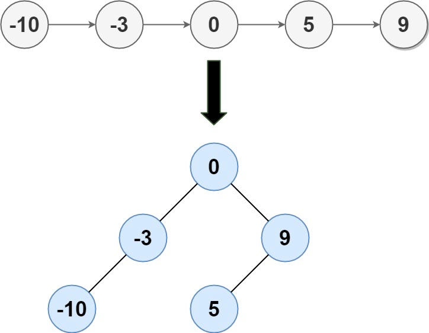

# 109. Convert Sorted List to Binary Search Tree

## Level - medium

## Task
Given the head of a singly linked list where elements are sorted in ascending order, convert it to a
height-balanced  binary search tree.

## Объяснение
Дан отсортированный список, который нужно преобразовать в бинарное дерево поиска.

## Example 1:

``
Input: head = [-10,-3,0,5,9]
Output: [0,-3,9,-10,null,5]
Explanation: One possible answer is [0,-3,9,-10,null,5], which represents the shown height balanced BST.
``

## Example 2:
``
Input: head = []
Output: []
``

## Constraints:
- The number of nodes in head is in the range [0, 2 * 10^4].
- -10^5 <= Node.val <= 10^5