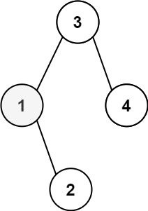

# 230. Kth Smallest Element in a BST


## Level - medium


## Task
Given the root of a binary search tree, and an integer k, return the kth smallest value (1-indexed) of all the values of the nodes in the tree.


## Объяснение
Задача состоит в том, чтобы написать функцию, которая принимает на вход корень BST и число k, 
и возвращает k-й наименьший элемент в BST.


## Example 1:

````
Input: root = [3,1,4,null,2], k = 1
Output: 1
````


## Example 2:

````
Input: root = [5,3,6,2,4,null,null,1], k = 3
Output: 3
````


## Constraints:
- The number of nodes in the tree is n.
- 1 <= k <= n <= 10^4
- 0 <= Node.val <= 10^4