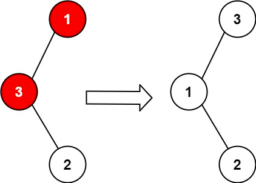
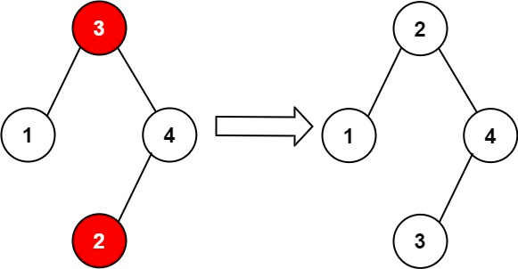

# 99. Recover Binary Search Tree


## Level - medium


## Task
You are given the root of a binary search tree (BST), where the values of exactly two nodes of the tree were swapped by mistake. 
Recover the tree without changing its structure.


## Объяснение
Это задача на поиск двух узлов в бинарном дереве поиска, которые были помечены неправильно.

Метод решения задачи, который я использую, основан на использовании инварианта BST (двоичное дерево поиска). 
В BST для любого узла выполняется условие: все узлы в левом поддереве меньше текущего узла, 
а все узлы в правом поддереве больше текущего узла.

Если мы нарушим этот инвариант, то два узла, которые были помечены неправильно, будут нарушать это условие.


## Example 1:

````
Input: root = [1,3,null,null,2]
Output: [3,1,null,null,2]
Explanation: 3 cannot be a left child of 1 because 3 > 1. Swapping 1 and 3 makes the BST valid.
````


## Example 2:

````
Input: root = [3,1,4,null,null,2]
Output: [2,1,4,null,null,3]
Explanation: 2 cannot be in the right subtree of 3 because 2 < 3. Swapping 2 and 3 makes the BST valid.
````


## Constraints:

- The number of nodes in the tree is in the range [2, 1000].
- -2^31 <= Node.val <= 2^31 - 1