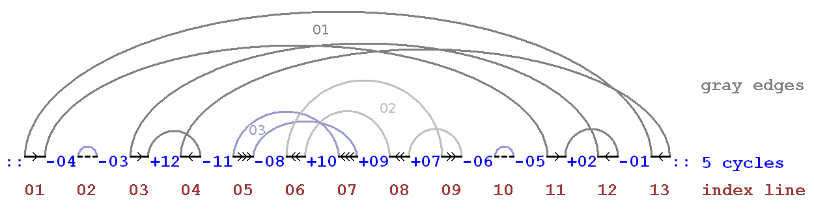

# Cycle sort

## Что это?
Cycle Sort - алгоритм сортировки, который использует сортировку сравнения, 
которая теоретически оптимальна с точки зрения общего количества записей в исходном массиве, 
в отличие от любого другого алгоритма сортировки на месте. 
Сортировка циклов - это неустойчивый алгоритм сортировки. 
Он основан на идее перестановки, в которой перестановки учитываются в циклах, 
которые индивидуально вращают и возвращают отсортированный результат. 

