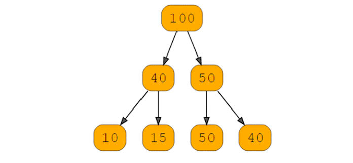

# Heap / Двоичная куча.

## Что это?
Куча (heaps) — это расширенная древовидная структура данных, используемая в основном для сортировки и реализации очередей приоритетов. 
Это полные бинарные деревья, которые имеют следующие особенности:
1. Заполнены все уровни, кроме листовых узлов (узлы без дочерних узлов называются листьями).
2. Каждый узел имеет максимум 2 дочерних элемента.
3. Все узлы расположены как можно дальше слева, это означает, что каждый дочерний элемент находится слева от своего родителя

Куча - абстрактная структура данных, поддерживающая следующие операции:
- Нахождение минимума
- Удалением минимума
- Добавление нового элемента в кучу

## Где используется:
- В алгоритмах поиска кратчайшего пути.
- Сортировка элементов, путем превращения массива в кучу, а кучу в отсортированный массив.

## Свойства:
- Левый потомок вершины с индексом i имеет индекс 2*i+1.
- Правый потомок вершины с индексом i имеет индекс 2*i+2.
- Корень дерева - это элемент с индексом 0.
- Высота(height) двоичной кучи равна высоте дерева, т.е. log_2(n), где n - количество элементов массива.

## Time complexity:
- Сортировка с применением двоичной кучи занимает O(n*log_2(n)). Это связано с тем, что сначала надо построить кучу -
  O(n), затем извлечение n элементов - O(n log_2(n))
- Нахождение минимума O(1).
- Удаление минимума O(h), где h - это высота дерева.
- Добавление нового элемента в кучу O(h), где h - это высота дерева.

## Плюсы
1. Сборка мусора выполняется в памяти кучи, чтобы освободить память, используемую объектом.
2. Кучи гибки, поскольку память может выделяться или удаляться в любом порядке.
3. Доступ к переменным можно получить глобально.
4. Это помогает найти минимальное и максимальное количество.

## Минусы
1. По сравнению со стеками, куча требует больше времени для выполнения.
2. В динамической памяти управление памятью сложнее, поскольку она используется глобально.
3. Обычно для вычисления кучи требуется больше времени.