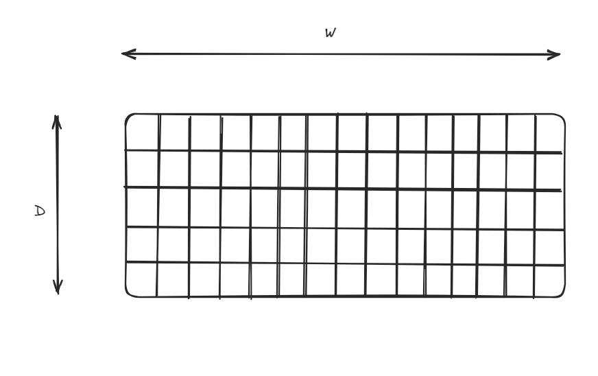
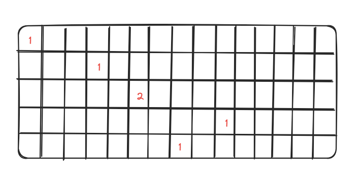

# Count-Min Sketch

## Min
Count-Min Sketch (CM-Sketch) - это структура данных, которая используется для подсчета элементов в больших наборах данных с небольшой потерей точности. 
Она основывается на идее хэширования и использует несколько матриц для подсчета.

CM-Sketch состоит из нескольких матриц, каждая из которых имеет размер w x d, где w - это ширина матрицы (количество столбцов), 
а d - это глубина матрицы (количество строк). Каждая ячейка в матрице представляет собой счетчик, который инициализируется нулем.

При добавлении элемента в CM-Sketch, он хэшируется несколько раз, получая несколько индексов для каждой строки матрицы. 
Затем значение счетчика в соответствующей ячейке увеличивается на 1.

При запросе количества элемента, он также хэшируется и используется для поиска минимального значения счетчика в соответствующих ячейках. 
Это минимальное значение представляет приблизительное количество элемента в наборе данных.

CM-Sketch имеет небольшую погрешность, но она может быть контролирована путем выбора подходящих параметров w и d. 
Также она эффективна для больших наборов данных, поскольку использует хэширование и не хранит сами элементы.

Count-Min Sketch использует несколько (D) хэш функций, для каждой из которых заводится массив счетчиков длины W.

Count-Min Sketch использует несколько (D) хэш функций, для каждой из которых заводится массив счетчиков длины W:

При запросе частоты встречаемости элемента процесс повторяется – вычисляются D хэшей, а частота вычисляется как min(f1, …, fD), чтобы избежать коллизий.

## Где используется?
- в приложениях по анализу сетевого трафика, частотности слов или обработке событий
- в Redis