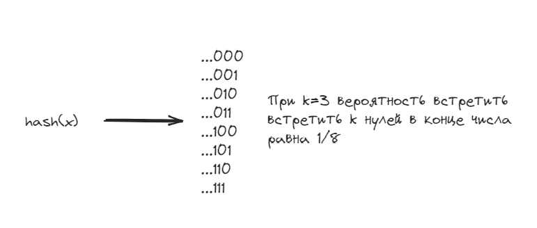

# HyperLogLog

## Что это?
HyperLogLog — это вероятностная структура данных, предназначенная для оценки количества уникальных элементов в наборе данных (кардинальности). Она использует мало памяти и подходит для работы с большими объемами данных, например, в распределенных системах или при анализе больших потоков информации.

## Как это работает?
HyperLogLog использует множество регистров (битовых массивов), в которые записываются значения, полученные из хеш-функций, применяемых к элементам множества. Каждому элементу присваивается позиция в этих регистрах, и для каждого регистра сохраняется количество нулей перед первым единичным битом в хеш-значении элемента. Это позволяет аппроксимировать общее количество уникальных элементов, оценив максимальное количество ведущих нулей в регистрах.

Это связано с тем, что если мы случайным образом хешируем большое количество уникальных элементов, то в некоторых регистрах будет встречаться больше ведущих нулевых битов, чем в других. Это дает возможность аппроксимировать количество уникальных элементов в наборе, так как количество ведущих нулевых битов связано с порядковым номером элемента в распределении.

## Сложности:
- **Время:** Вставка и обновление элемента — O(1).
- **Память:** O(m), где m — количество регистров. Для точности оценки часто используется порядка 128-2048 регистров.

## Сценарий использования:
HyperLogLog часто применяется в системах аналитики и мониторинга для подсчета уникальных элементов, таких как уникальные IP-адреса, идентификаторы пользователей или запросы в поисковых системах. Это эффективная альтернатива традиционным методам подсчета уникальных элементов, таким как использование хеш-таблиц, так как она требует значительно меньше памяти.

## Как улучшить точность?
1. **Увеличить количество регистров:** Увеличив количество регистров m, вы можете улучшить точность оценки кардинальности. Формула погрешности:  
   \[
   \text{error} \approx \frac{1.04}{\sqrt{m}}
   \]  
   где m — количество регистров.

2. **Использовать несколько экземпляров:** Чтобы уменьшить погрешность, можно использовать несколько экземпляров HyperLogLog и усреднять результаты.

## Где используется?
Presto и многие другие движки для обработки больших объёмов данных используют HyperLogLog для примерной оценки количества элементов,  что требует гораздо меньше памяти по сравнению с COUNT(DISTINCT).