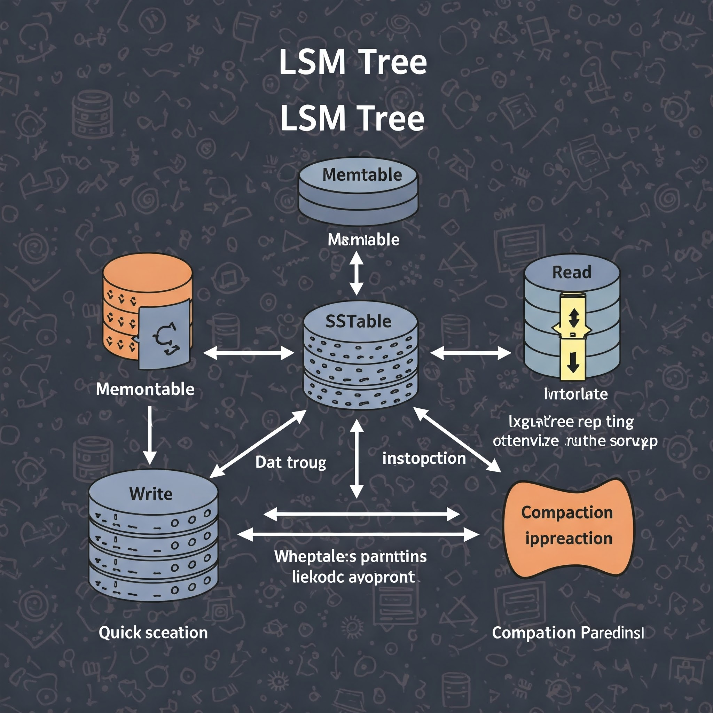

# LSM-Tree (Log-Structured Merge-Tree)

## Что такое LSM-Tree?
LSM-Tree (Log-Structured Merge-Tree) — это структура данных, оптимизированная для высокоскоростной записи. Она широко используется в базах данных и хранилищах, таких как **LevelDB, RocksDB, Cassandra**, для эффективной работы с диском и хранения ключ-значений.

## Основные компоненты LSM-Tree

### 1. **Мемтаблица (MemTable)**
- Данные сначала записываются в память в виде **сбалансированного дерева** (обычно **Red-Black Tree** или **Skip List**).
- После достижения определённого объёма мемтаблица сбрасывается на диск в виде **SSTable (Sorted String Table)**.

### 2. **SSTable (Immutable Sorted Table)**
- Это упорядоченные файлы на диске, содержащие **отсортированные ключи и значения**.
- SSTable создаётся при сбросе мемтаблицы на диск.
- Может быть организована в **несколько уровней (Level 0, Level 1, ...)** для оптимизации чтения и записи.

### 3. **Блум-фильтры (Bloom Filters)**
- Используются для быстрой проверки наличия ключа в SSTable перед её загрузкой с диска.
- Помогают ускорить операции поиска, снижая количество ненужных обращений к файлам.

### 4. **Компакция (Compaction)**
- Периодически SSTables объединяются (сливаются) в более крупные и упорядоченные файлы.
- Компакция предотвращает рост числа SSTables и уменьшает накладные расходы на поиск.

## Принцип работы LSM-Tree
1. **Запись**:
   - Данные записываются сначала в мемтаблицу.
   - Когда мемтаблица достигает лимита, она сбрасывается в SSTable на диск.
   - Компакция периодически объединяет SSTables в более крупные файлы.

2. **Чтение**:
   - Сначала проверяется **мемтаблица**.
   - Если данных там нет, используются **SSTables** (начиная с младших уровней).
   - Для ускорения поиска применяется **Блум-фильтр** и индексы.

## Достоинства LSM-Tree
✅ Высокая производительность записи (append-only).  
✅ Эффективная работа с дисковыми носителями (особенно SSD).  
✅ Поддержка больших объемов данных за счёт компакции.  

## Недостатки LSM-Tree
❌ Задержки при чтении из-за множества уровней SSTable.  
❌ Дополнительные затраты на компакцию (нагрузка на CPU и диск).  

## Где используется LSM-Tree?
- **NoSQL базы данных**: LevelDB, RocksDB, Cassandra, HBase.
- **Журналы событий**: Kafka, Apache Pulsar.
- **Файловые системы**: WiscKey, F2FS.

---
LSM-Tree — это мощная структура данных, оптимизированная для записи и широко применяемая в современных системах хранения данных. 🚀

## SSTable (Sorted String Table)

## Визуализация LSM-Tree
