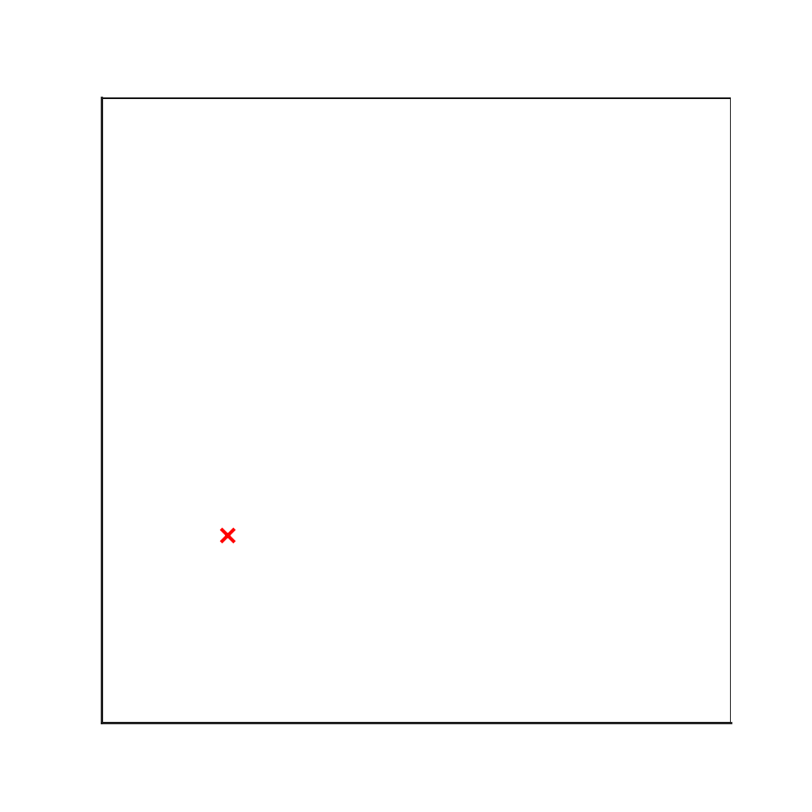

# Quad Tree

## Описание структуры данных

**Quad Tree** (четверичное дерево) — это древовидная структура данных, в которой каждый узел делится на четыре дочерних узла. 
Эта структура используется для разбиения двумерного пространства на области, что делает её полезной для различных задач, связанных с пространственным индексированием.
Quad Tree — мощная структура данных, которая широко применяется в компьютерной графике, играх, геоинформационных системах и обработке изображений. 
Её основное преимущество — это возможность эффективного разбиения двумерного пространства и быстрой работы с разреженными данными.


### Основные характеристики:
- Каждый узел содержит до четырёх дочерних узлов.
- Разбиение пространства происходит рекурсивно до тех пор, пока не достигнут заданные условия (например, минимальный размер ячейки или максимальное количество объектов в узле).
- Часто используется для представления разреженных данных, где области без информации не требуют хранения дополнительных узлов.

## Применение

### 1. Компьютерная графика
- Разбиение сцены для ускорения рендеринга (Binary Space Partitioning, BSP).
- Хранение изображений в видеорежиме, например, векторная графика и компрессия изображений.

### 2. Географические информационные системы (GIS)
- Индексирование картографических данных.
- Оптимизация хранения данных о территориях, дорогах и других объектах.

### 3. Коллизии в игровых движках
- Оптимизация проверки столкновений между объектами.
- Эффективное управление областями интереса в играх с открытым миром.

### 4. Сжатие данных
- Квадратное разбиение изображений для алгоритмов сжатия, таких как формат JPEG2000.

### 5. Обработка изображений
- Оптимизация алгоритмов поиска в картинках.
- Разделение изображений на области для быстрого поиска объектов.

## Пример структуры Quad Tree

Пример разбиения пространства на основе Quad Tree:

```
Корень
├── Верхний левый квадрант
├── Верхний правый квадрант
├── Нижний левый квадрант
└── Нижний правый квадрант
```


## Ссылки
