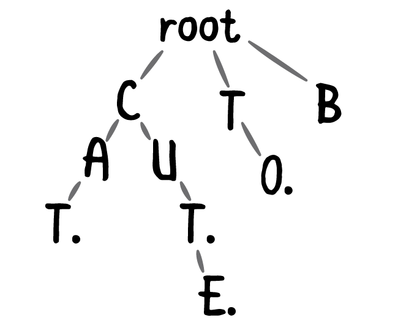

# Префиксное дерево (Trie)

## Что такое префиксное дерево?

Префиксное дерево (или Trie) — это древовидная структура данных, предназначенная для эффективного хранения строк и поиска по префиксам. В отличие от обычных деревьев поиска, в Trie каждый узел хранит один символ из строки. Строки, которые имеют общие префиксы, будут иметь общие части дерева, что позволяет экономить память.

Префиксное дерево (Trie) является мощным инструментом для работы с набором строк, обеспечивая быстрые операции поиска и вставки, а также поддержку поиска по префиксу. Однако его использование требует учета затрат памяти, особенно в случае работы с большим количеством данных.

### Основные особенности:
- Каждый узел представляет один символ.
- Путь от корня дерева до листа соответствует строке.
- Строки с одинаковыми префиксами разделяют одинаковые пути в дереве.

## Где применяется префиксное дерево?

Префиксное дерево активно используется в следующих областях:
- **Автозавершение**: Для реализации функции автозаполнения или поиска по префиксу.
- **Поиск слов**: Например, для проверки слов в словаре, поиска по суффиксам и префиксам.
- **Поиск по паттернам**: Для быстрого поиска всех строк, начинающихся с определенного префикса.
- **Сжатие данных**: Может использоваться для сжатия строк, особенно когда строки имеют общие части.

## Время работы

- **Вставка** строки: O(k), где k — длина строки.
- **Поиск** строки: O(k), где k — длина строки.
- **Поиск по префиксу**: O(k), где k — длина префикса.
  
Таким образом, сложность операций зависит от длины строки или префикса, что делает Trie быстрым для работы с набором строк.

## Плюсы префиксного дерева

- **Быстрые поисковые операции**: Операции поиска и вставки имеют линейную сложность относительно длины строки, что очень эффективно при большом наборе строк.
- **Поддержка поиска по префиксу**: Это основной плюс, который делает Trie идеальным для таких задач, как автозавершение или поиск всех слов, начинающихся на определенную подстроку.
- **Предсказуемая производительность**: Независимо от общего количества строк в Trie, время работы зависит только от длины строк.

## Минусы префиксного дерева

- **Большие затраты памяти**: Для каждого символа строки требуется отдельный узел в дереве, что может привести к большим затратам памяти, особенно при хранении большого количества коротких строк.
- **Неэффективность для коротких строк**: В случае работы с очень короткими строками, где нет общих префиксов, Trie может быть менее эффективен по памяти по сравнению с другими структурами данных.
- **Сложность реализации**: Реализация Trie может быть более сложной, чем использование других структур данных, таких как хеш-таблицы или массивы.

## Визуализация Trie
                   root
                  /    \
               'a'      'b'
              /   \     /
            'p'    'l' 'a'
           /   \      \   \
         'p'    'e'   'e' 't'
        /    \       /
     'l'      'e'  's'
    /
  'e'

## Example
