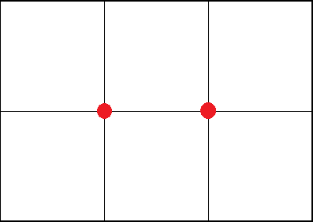

# B. Выдача токенов

## Ограничения
- Ограничение времени: 1 секунда
- Ограничение памяти: 64 Мб
- Ввод: стандартный ввод или input.txt
- Вывод: стандартный вывод или output.txt

## Описание
В связи с ростом популярности LLM было принято решение организовать пункты выдачи сгенерированных токенов. Город представляет собой сетку из $N \times M$ квадратных кварталов одинакового размера. Пункты выдачи могут размещаться в любой точке линий сетки кварталов, включая пересечение линий. Квартал считается покрытым, если хотя бы в одной точке его границы есть пункт выдачи.

Определите наименьшее количество пунктов выдачи, с помощью которых можно охватить все кварталы города.

## Формат ввода
В единственной строке вводится два целых числа $N$ и $M$ ($1 \le N, M \le 1000$).

## Формат вывода
Если введено некорректное значение N или M — выведите -2.

Выведите единственное число — минимальное количество пунктов выдачи.

## Система оценивания
Решения, верно работающие при $N, M \le 5$ будут набирать не менее 40 баллов.

## Примеры
### Пример 1
Ввод
```
1 1
```
Вывод
```
1
```

### Пример 2
Ввод
```
2 3
```
Вывод
```
2
```

## Примечания
Возможный вариант размещения пунктов выдачи для второго примера:


